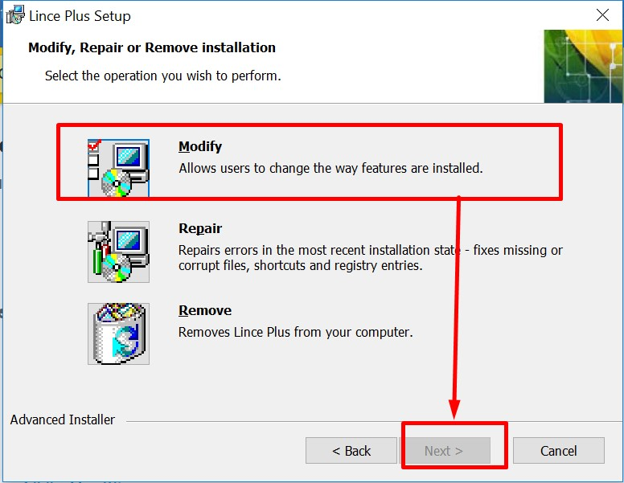
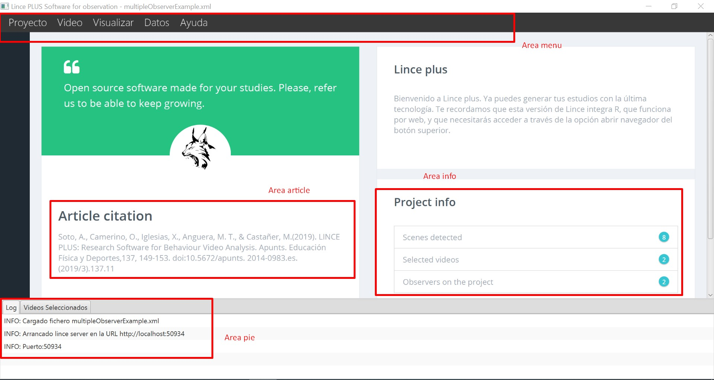
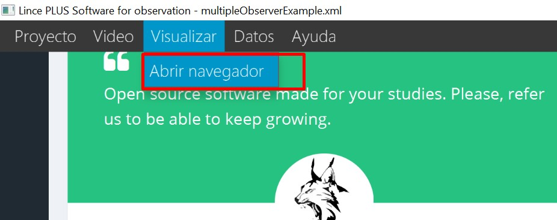
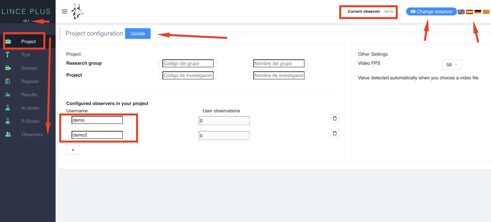
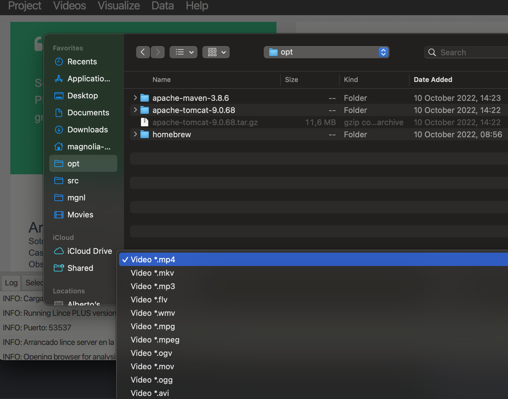
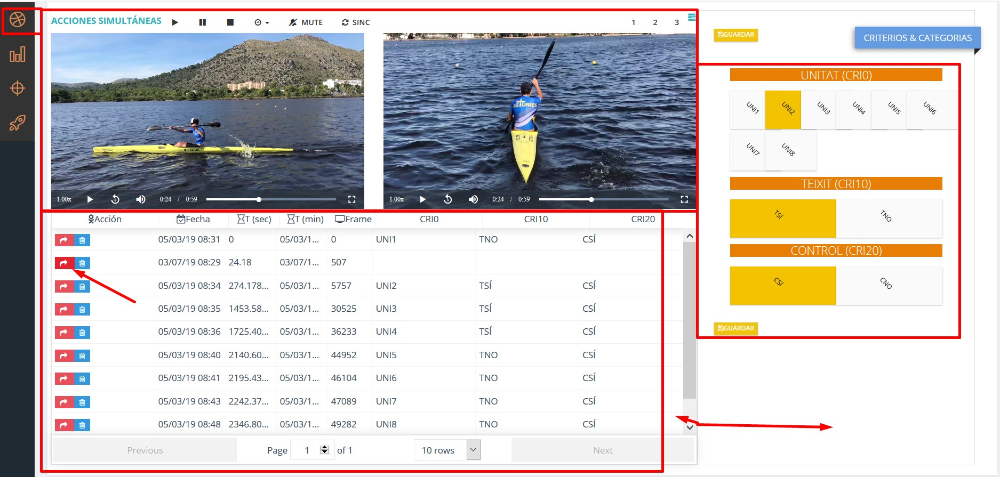
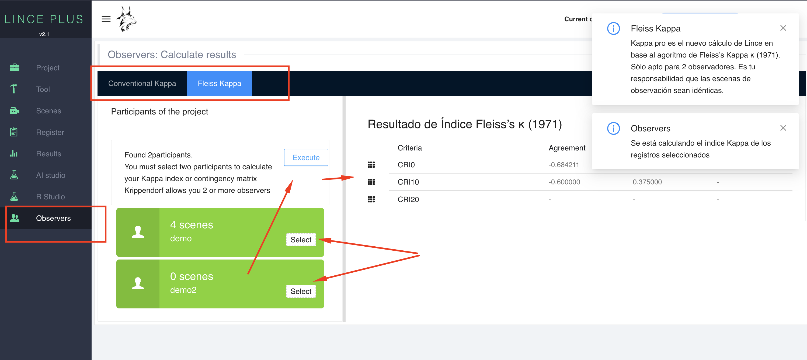
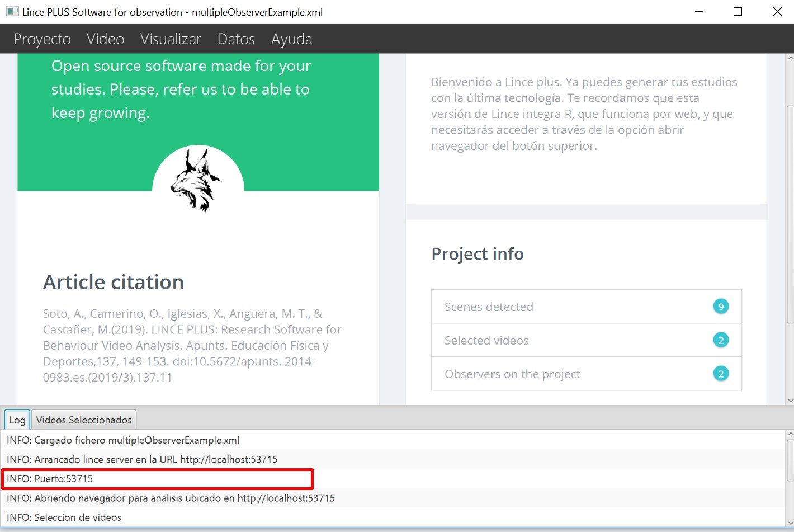
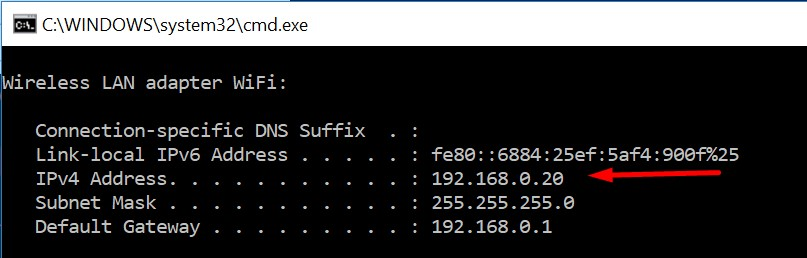
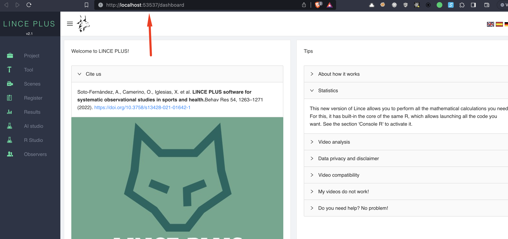

# LINCE PLUS Desktop (German)

Welcome to LINCE PLUS Docs

## Installation and use manual


### Computeranwendung für die Automatisierung von Beobachtungsprotokollen

Lince ist ein freies und quelloffenes Projekt, das aus dem universitären Umfeld hervorgegangen ist, um die Forschung und Verbreitung zu erleichtern. Wir danken Ihnen, dass Sie die Verbreitung und das Zitieren erleichtern, denn nur so können wir das Produkt weiter ausbauen und weiterentwickeln.


Diese Software wurde im Rahmen der folgenden Projekte entwickelt: New approach of research in physical activity and sport from mixed methods perspective (Ministry of Science, Innovation, 2019-2021); Integration von Beobachtungsdaten und Daten von externen Sensoren: Evolución del software LINCE PLUS y desarrollo de la aplicación móvil para la optimización del deporte y la actividad física beneficiosa para la salud [EXP\_74847] (Ministerio de Cultura y Deporte, Consejo Superior de Deporte and European Union. 2023). Forschungsprojekte in Wissenschaft und Technologie, angewandt auf die Tätigkeit (CSD, 2023), und es wurde vom Institut Nacional d'Educació Física de Catalunya (INEFC) finanziert.

### Wissenschaftliche Artikel

- Soto, A, Camerino, O, Anguera, M.T., Iglesias, X., & Castañer, M., (2022): LINCE PLUS Software for Systematic Observation Studies of Sports and Health. Behavior Research Methods 54 , 1263–1271 , https://doi.org/10.3758/s13428-021-01642-1
- Soto, A., Camerino, O., Iglesias, X., Anguera, M. T., & Castañer, M. (2019). LINCE PLUS: Research Software for Behaviour Video Analysis. Apunts. Educación Física y Deportes, 137, 149-153. https://doi.org/10.5672/apunts.2014-0983.es.(2019/3).137.11


[](#trueinformation-about-lince-plus)Informationen über LINCE PLUS
-----------------------------------------------------------------

LINCE PLUS ist ein Programm, das ständig weiterentwickelt wird und neue Funktionen enthält, die die Anforderungen an das System erhöhen, so dass es auf relativ leistungsstarken Computern laufen sollte.

[](#truesystem-requirements)Systemanforderungen
-----------------------------------------------

System requirements:

* Java 17 or higher, included in the software by default

* Mac OS, Linux or Windows


Systemanforderungen:

* Windows 10 or Mac Os Catalina

* More than 4 GB RAM

* Java 17 or higher, bundled with the app

* Intel i5 (7a gen) or higher


LINCE PLUS verfügt über einen internen Server, der mehr Rechenleistung benötigt als in früheren Versionen erwartet. Alle Informationen sind durch die Verwaltungsressourcen des Systems vollständig geschützt.


[](#truelince-plus-installation)LINCE PLUS Installations- und Gebrauchsanleitung
-------------------------------------------------------

Diese Informationen umfassen die ersten Schritte zur Installation und Verwendung von Lince Plus ohne Vorkenntnisse.

LINCE PLUS kann von der offiziellen Website heruntergeladen werden [https://observesport.github.io/lince-plus/](https://observesport.github.io/lince-plus/)

Beim Zugriff auf das Internet wird empfohlen, die neueste verfügbare Version herunterzuladen. Jede Version enthält neue Funktionen und behebt Probleme, die von verschiedenen Benutzern gemeldet wurden. Um die verschiedenen Versionen und die eingeführten Änderungen zu sehen, klicken Sie auf den Abschnitt „Release Notes“ auf der Website.


### [](#truewindows-installation)Windows installation

Um LINCE PLUS zu installieren, folgen Sie dieser Anleitung:

Besuchen Sie die Website des Lince Repository http://observesport.github.io/lince-plus/, um das LINCE PLUS-Programm im Abschnitt „Downloads“ zu erhalten, indem Sie auf den Link klicken und es ausführen. \*Wenn Sie in Windows 10 eine Schutzmeldung erhalten, akzeptieren Sie diese und autorisieren Sie die Installation. Die Software ist nicht bösartig.

Drücken Sie auf „Weiter“, „Bedingungen akzeptieren“ und „Installieren“, um den Installationsvorgang vorzubereiten (Abbildung 1). Dann werden Sie gefragt, ob es eine frühere Version gibt, und in diesem Fall müssen Sie „Ändern“ wählen (Abbildung 2).


Nach der Annahme beginnt der Installationsprozess. Fahren Sie mit dem nächsten Bildschirm fort.




Sobald Sie die Java-Version installiert haben, wird das Installationsprogramm die Installation von LINCEPLUS beenden. Das Symbol wird zur Ausführung auf Ihrem Desktop platziert.


Once you have installed the java version, the installer will finish with the installation of LINCE PLUS. Its icon will be placed your desktop for execution.

### Mac OS installation

* We are continuously building and improving the installer
* Due to license cost, MacOs Installer will be blocked on the first install
* YOU NEED TO ENABLE MAC OS EXTERNAL SOFTWARE to install LINCE PLUS, check image bellow
* For more information, please follow https://support.apple.com/en-us/HT202491


* The next step is to open the .zip file of Lince plus and execute directly.


## Informationen über LINCE PLUS

In diesem Abschnitt werden die Funktionen von LINCE PLUS erläutert. Es wird empfohlen, diesen Abschnitt aufmerksam zu lesen und die im Programm selbst beschriebenen Aktionen zu testen, um die Funktionsweise zu verstehen.

Um LINCE PLUS auszuführen, können Sie auf die Desktop-Verknüpfung klicken oder es über die Schaltfläche Start unter den Programmen suchen.

### Hauptseite

Um es auszuführen, doppelklicken Sie auf das Desktop-Symbol und LINCE PLUS wird auf dem Startbildschirm gestartet (Abbildung 7).


LINCE PLUS wurde mit dem Ziel Einfachheit entwickelt, um die Aufgaben des Benutzers zu erleichtern, aber die Verwendung der Webtechnologie erfordert, dass Sie sich vor Augen halten, dass es zwei Komponenten hat: die Desktopanwendung und den Webzugang, den die Anwendung selbst generiert.

Um es auszuführen, doppelklicken Sie auf das Desktop-Symbol und LINCE PLUS wird auf dem Startbildschirm gestartet (Abbildung 7).

### Informationen über LINCE PLUS

Die LINCE PLUS Umgebung ist in zwei verschiedene Bereiche unterteilt:

- Die Desktop- oder Serveranwendung (Lince-Desktop). Diese ist verantwortlich für die Speicherung der Informationen, die Verwaltung der zu beobachtenden Videos und die Ausführung aller Arten von Importen oder Exporten. Sie wird auch verwendet, um die Registrierungsdaten zu verwalten.
- Die Webanwendung (Lince web). Sie funktioniert nur, wenn LINCE PLUS desktop ausgeführt wird. Sie führt die Interaktion mit den Daten und die Analyse der Untersuchung durch.

### Die Desktopanwendung

In dieser Anwendung können Sie alle Projektinformationen verwalten und sie haben 4 Arbeitsbereiche (Abbildung 8):

- Menübereich: Von hier aus können Sie die Forschungsprojekte, die ausgewählten Videos und die Interaktion mit anderen Anwendungen, die Sie möglicherweise nutzen, verwalten.

- Menübereich: In diesem Bereich finden Sie eine Zusammenfassung des Projekts. Wenn jemand verbunden ist, können Sie sehen, wie sich Szenen, Beobachter oder andere Daten verändern.

- Menübereich: Zitieren Sie uns mit dem angegebenen Link. Vielen Dank im Voraus.

- Unterer Bereich oder Fußzeile: Sie können Programmmeldungen sehen und in Windows wird das zuletzt verwendete Projekt geladen, außerdem wird der PORT angezeigt, an dem es läuft. Dieser Aspekt ist von entscheidender Bedeutung und wird im Abschnitt „Erste Schritte mit LINCE PLUS“ näher erläutert.



### Die Desktopanwendung

Wählen Sie in der LINCE PLUS Desktop-Symbolleiste „Ansicht“ → „Browser öffnen“, und es öffnet sich ein Browser-Bildschirm.



In der oberen Leiste Ihres Browsers können Sie die Zugangsadresse zum Lince-Webportal sehen. Die Adresse ist ein Wert ähnlich dem Folgenden: http://192.168.1.10:555. In Abbildung 8 ist im unteren Bereich ein Wert mit der Bezeichnung „Port“ zu sehen. Dieser Wert ergibt zusammen mit der IP-Adresse des Rechners die spezifische Zugangsadresse zur Webanwendung (Abbildung 10).



In diesem Browserfenster können Sie Folgendes sehen (Abbildung 10):

- Oberes Menü. Hier können Sie die laufende Version und die Sprachauswahl sehen und die allgemeinen Informationen des Projekts ändern. Oben rechts sehen Sie eine Option zur Auswahl des Beobachters, die im Abschnitt „Erste Schritte mit LINCE PLUS“ und im Abschnitt „Gruppenarbeit“ näher erläutert wird.

- Oberes Menü. Mit Hilfe der Symbole in diesem Bereich können Sie die verschiedenen Phasen der Beobachtungsmethodik verfolgen, angefangen bei der Erstellung des Beobachtungsinstruments über die Auswahl von Momenten oder Episoden, die aufgezeichnet und analysiert werden sollen, bis hin zur Analysephase. Dort sehen Sie ein einfaches Diagramm, das Ihre Beobachtungen zusammenfasst. Darüber hinaus gibt es einen speziellen Abschnitt zur Ergebnisinterpretation, indem Sie Ihre Ergebnisse direkt mit R  programmieren oder die Zuverlässigkeit zwischen verschiedenen Beobachtern statistisch ermitteln können.

Als allgemeine Richtlinie gibt es auf jedem Bildschirm eine Reihe von Symbolen, mit denen Sie das Panel verschieben, maximieren, minimieren oder den Arbeitsbereich aufteilen können. Mit dem Symbol oben rechts können Sie das Panel auf die volle Bildschirmgröße vergrößern und bei erneuter Auswahl wieder auf die ursprüngliche Größe verkleinern.

## Erste Schritte mit LINCE PLUS

Wenn Sie mit LINCE PLUS beginnen, müssen Sie sich über das Ziel Ihres Forschungsprojekts im Klaren sein, um eine gültige Struktur des Prozesses erstellen zu können. Zuallererst müssen folgende Punkte berücksichtigt werden:

- Wie viele Beobachter nehmen an dem Projekt teil?

- Wurde das Beobachtungsinstrument bereits erstellt?

- Wie viele und welche Videos werde ich sehen? Haben sie die gleiche Dauer?


### Konfiguration Beobachtungsinstrument

Die Erstellung des Beobachtungsinstruments ist die erste Stufe des Prozesses. Es kann sowohl für eindimensionale als auch für mehrdimensionale Designs vorgeschlagen werden.

Die Typologie des Beobachtungsinstruments umfasst ein Kategoriensystem (es gibt eine Dimension oder ein Kriterium), ein Feldformat (es gibt mehrere Dimensionen oder Kriterien und Verhaltenskataloge für jede dieser Dimensionen oder Kriterien) oder ein Feldformat in Kombination mit Kategoriesystemen (es gibt mehrere Dimensionen oder Kriterien und Kategoriensysteme oder Verhaltenskataloge entsprechend den Merkmalen der einzelnen Dimensionen oder Kriterien).

Mit der Option KONFIGURIEREN im Menü auf der linken Seite können Sie die Struktur des Beobachtungsinstruments erstellen, indem Sie zunächst die Kriterien/Dimensionen und dann die Verhaltenskategorien/Kataloge sehr einfach festlegen und sie mit Hilfe der im Bild gezeigten Icons intuitiv sortieren. Wenn Sie die Taste SPEICHERN drücken, wird eine Bestätigungsmeldung angezeigt.


Abbildung 11: Konfiguration Beobachtungsinstrument

Das Beobachtungsinstrument wird allen Nutzern zur Verfügung stehen, die mit demselben Projekt verbunden sind.

#### Automatische Konfiguration des Beobachtungsinstruments

LINCE PLUS ermöglicht es Ihnen, ein Instrument automatisch zu generieren, die Tasten zu erstellen und es schnell und einfach zu kodieren. Wir empfehlen diese Option, wenn Sie schnell vorankommen oder Tests vorbereiten wollen, die Sie später bearbeiten möchten. Dazu muss ein leeres Instrument wie in der beigefügten Abbildung erstellt werden, das beim Speichern automatisch alle Felder ausfüllt und sie nacheinander aufruft.

Wählen Sie einfach die hinzuzufügenden Optionen mit dem +-Symbol aus und generieren Sie alle gewünschten Kriterien/Dimensionen und Kategorien/Verhaltensweisen, ohne einen Text einzugeben oder geben Sie nur die Werte ein, die Sie interessieren. Diese Option ist sehr nützlich, wenn die Bezeichnung noch nicht endgültig ist oder wenn Sie direkt völlig induktiv beginnen wollen. In der folgenden Abbildung sehen Sie das generierte Ergebnis.


Sie können sehen, wie durch die Auswahl von SPEICHERN die Informationen automatisch ausgefüllt werden. Dann können Sie die gewünschten Werte ändern, aber vergessen Sie nicht das SPEICHERN, bevor Sie diese Option verlassen.


### Video-Auswahl


Mit LINCE PLUS können Sie mehrere Videos gleichzeitig abspielen.

Um auf Ihre Auswahl zuzugreifen, müssen Sie die Lince-DesktopAnwendung verwenden. Im oberen Menü befindet sich die Registerkarte „Video“ → „Videos auswählen“. Wenn Sie die gesamte Auswahl löschen möchten, gibt es auch dafür die Option. Am unteren Rand des Bildschirms befindet sich eine Registerkarte mit der Bezeichnung „Ausgewählte Videos“, die eine aktualisierte Auswahl enthält. Sie können auch unter „Projektinfo“ sehen, wie viele Videos ausgewählt sind.


Im Videoselektor wird die Liste der unterstützten Formate angezeigt. Da LINCE PLUS den Webbrowser zum Abspielen von Videos verwendet, muss das Videoformat vom Browser des Nutzers wiedergegeben werden können. Falls andere Formate verwendet werden, sollten Sie sie in ein gültiges Format umwandeln.



Wenn mehrere Videos gleichzeitig gezeigt werden, achten Sie darauf, dass sie die gleiche Dauer haben, sonst kann LINCE PLUS nicht erkennen, welche vorläufige Markierung des Videos Sie für die Registrierung verwenden möchten.

Ein weiterer Aspekt, der zu berücksichtigen ist, ist die Größe des Videos. Alle ausgewählten Videos werden gleichzeitig in den Speicher des Computers geladen. Wenn mehrere 2-GB-Videos ausgewählt werden, muss der Computer in der Lage sein, diese abzuspielen.

### Anzahl der Beobachter

Wenn es nur einen Beobachter im Projekt gibt, ist es nicht notwendig, diese Konfiguration auszufüllen, und das Programm wird transparent handeln. Wenn jedoch 2 oder mehr Beobachter teilnehmen, muss dies von Anfang an angegeben werden.


In der obersten Schaltfläche der Webumgebung gibt es eine Option namens „Projektinformationen“. Es ist wichtig, von Anfang an festzulegen, wie viele Beobachter die Beobachtung durchführen werden, und Sie müssen die verschiedenen Felder ausfüllen und dann auf die Schaltfläche oben rechts klicken, um „alles zu speichern“.


Nun müssen Sie zu einer anderen Option navigieren, um die Seite zu aktualisieren. Wählen Sie die rechte Schaltfläche in der oberen Leiste und wählen Sie „Beobachter ändern“.

Um den Beobachter zu ändern, wählen Sie einen aus und markieren Sie ihn als aktiv. Sie sehen jetzt die enthaltenen Datensätze, die Sie haben analysieren lassen, und die vorläufigen Markierungen.


### Informationen zum Projekt

Sobald Sie die Videos konfiguriert und die Projektinformationen eingerichtet haben, empfehlen wir Ihnen, Ihr Projekt zu speichern, um Datenverluste zu vermeiden. Wählen Sie dazu die Option Projekt → Speichern unter


Wenn Sie Lince Desktop schließen, werden Sie aufgefordert, das Projekt zu speichern. Es wird jedoch empfohlen, das Projekt kontinuierlich zu speichern.

In einer Windows-Umgebung wird LINCE PLUS beim nächsten Start automatisch das zuletzt gespeicherte Projekt laden. Diese Option ist sehr nützlich, um die Arbeit an der gleichen Forschung fortzusetzen.

Wenn Sie ein Projekt haben, das unter Lince 1.4 oder früher erstellt wurde, können Sie es auch mit der Datensatzdatei oder der Instrumentendatei in Ihre Forschung einbinden. Sie können dies im Abschnitt „Importieren und Exportieren in externe Tools“ im Detail sehen.

### Abgrenzung der Beobachtungsepisoden

Die Episodenabgrenzung ist eine neue Funktion, die es Ihnen ermöglicht, die Beobachtungsstichprobe einzustellen. Die Videos werden in einer Vorschau angezeigt, in der Sie auswählen können, was Sie beobachten möchten, und Sie können zusätzliche Kommentare hinzufügen.

Diese Option wird über den Abschnitt „Szenen“ im Seitenmenü aufgerufen. Zuvor müssen Sie ausgewählte Videos zur Registrierung ausgewählt haben.


In diesem Player gibt es mehrere Arbeitsbereiche:

- Ein synchronisierter Videoplayer, der alle enthaltenen Videos gleichzeitig abspielt. Mit der SYNC-Taste können Sie die Videos zum gleichen Zeitpunkt wie beim ersten Video synchronisieren. Sie können auch die Abspielgeschwindigkeit für alle Videos einstellen.

- Eine individuelle Steuerung für jedes Video, mit der Sie alle Aspekte, einschließlich der Abspielgeschwindigkeit, kontrollieren können.

- Eine Wahltaste, die angibt, wie viele Videos Sie zusammen ansehen möchten, und deren Anordnung und Standardgröße Sie ändern können.

- Ein Menü mit gefundenen Episoden. In jeder Episode können Sie:
  - Abspielen: Eine rote Taste, die sofort die gespeicherte Videozeit abspielt.
  - Bearbeiten: Eine Schaltfläche zum Bearbeiten, um einen Kommentar hinzuzufügen.
  - Löschen: Ermöglicht das Löschen der eingegebenen Szene und der darin enthaltenen beobachteten Datensätze


### Analyse

Diese Option ist der Hauptarbeitsbereich für die Beobachtung. Sie wurde so gestaltet, dass sie möglichst einfach ist und der vorherigen Version von Lince ähnelt. Alle zuvor vorgestellten Episoden mit den beobachteten Aufzeichnungen werden gefunden.



Auf diesem Bildschirm werden mehrere Abschnitte angezeigt:

- Player-Bereich: Der Player hat die gleichen Bedingungen wie der vorherige und im rechten Seitenbereich sehen Sie das Beobachtungsinstrument.

- Menübereich: Alle ausgewählten Episoden werden mit den registrierten Beobachtungswerten angezeigt. Sie können alle Werte ordnen und bearbeiten. Wenn Sie eine Beobachtung ändern möchten, drücken Sie die rote  Schaltfläche und geben Sie die neue Beobachtung im Instrumentenbereich ein. Speichern Sie die Daten, um Änderungen zu erhalten, ohne Ihren Zeitplan zu ändern.

- Player-Bereich: Hier können Sie markieren, was in den Videos beobachtet wird. Beim Speichern einer neuen Episode wird die temporäre Markierung des ersten Videos erzeugt und eingefügt, ähnlich wie bei den Episoden.

- Player-Bereich: Dies sind Steuerelemente, mit denen Sie den Arbeitsbereich für Video und Instrument anpassen können, indem Sie die Größe ändern und mit einer vertikalen Linie verschieben können.

### Registerkarten

Diese Option zeigt Ihr Register visuell mit einfachen Diagrammen an. Im folgenden Beispiel sehen Sie, dass es in der Episode 24,18 einen Moment gibt, in dem noch keine Beobachtung aufgezeichnet wurde.


Sie können die Elemente des Beobachtungsinstruments in Prozenten und Tendenzen in den verschiedenen Episoden des Datensatzes visuell überprüfen.

### Datenanalytik

LINCE PLUS erleichtert die automatische Berechnung der Ergebnisse ohne externe Tools, entweder durch die Verwendung der Programmiersprache R oder durch den automatischen Vergleich mehrerer Beobachter zur Berechnung des Übereinstimmungsindexes, einschließlich der Kontrolle der Datenqualität.

#### Statistische Daten
#### Statistische Ergebnisse mit R

Dies ist eine der größeren Neuerungen von LINCE PLUS, denn von nun an ist eine R-Sprachengine enthalten. Wenn Sie zur Option R-Konsole navigieren, finden Sie eine Komponente, mit der Sie die gewünschten Ergebnisse für Ihre Analyse berechnen können.


Um diese Funktion richtig nutzen zu können, müssen Sie über Kenntnisse der Programmiersprache R verfügen.

- Im linken Bereich befindet sich ein Feld zur Eingabe des Quellcodes und eine Schaltfläche zum Ausführen des Codes. Im oberen Bereich befinden sich die Variablen, die von Lince in den R-Ausführungskontext geladen werden und die Sie in Ihrem Code verwenden können. Wenn Sie auf AUSFÜHREN aktivieren, wird der Ergebnisbereich angezeigt.

- Im rechten Bereich sehen Sie den Text mit den Ergebnissen Ihrer Berechnung.

- Im unteren Bereich gibt es einen HILFE-Bereich, um die Informationen mit einigen Ratschlägen zu erweitern.

Die Grafiken von R sind nicht enthalten, können aber direkt von R-Studio aus aufgerufen werden. Sie können den Abschnitt mit den besonderen Merkmalen dazu konsultieren.

Im Gegensatz zu R müssen Sie am Ende jeder Zeile ";" eingeben. In R-Studio ist dies nicht zwingend erforderlich.

**print(linceDataByCategory);**

Dieser Code zeigt Ihnen auf dem Bildschirm die Matrix des Datensatzes nach Kategorien gegliedert an. Sie können die Zeit in ms und das genaue Einzelbild auf der Basis von 21fps beobachten.


Die Absicht von Lince Plus ist, dass diese Option von Experten genutzt werden kann.

#### Berechnung der Übereinstimmung zwischen mehreren Beobachtern


Wenn mehrere Beobachter an dem Projekt teilnehmen, können Sie mit LINCE PLUS die Übereinstimmung zwischen den verschiedenen Beobachtern berechnen und feststellen, ob sie bei der Erfassung der gleichen Aspekte in der Beobachtung übereinstimmen, indem Sie die Übereinstimmungsraten durch Kappa oder Krippendorf berechnen und die Kontingenzmatrix zwischen Ihren Beobachtungen erstellen.

Für die Berechnung müssen die Beobachter die gleichen Episoden, die gleiche Anzahl von Episoden und eine unabhängige Aufzeichnung von jeder dieser Episoden haben.




Wie wird die Berechnung durchgeführt:

1. Wählen Sie im Menü auf der linken Seite die Schaltfläche „+“, um eine Vorschau des Beobachtereintrags anzuzeigen. Sie können mehrere Male auswählen und sehen, wie sich die Farbe von grün zu weiß ändert. Wenn sie grün leuchtet, ist der Beobachter ausgewählt.

1. Wählen Sie einen anderen Beobachter und rufen Sie das gewünschte Ergebnis im oberen Menü auf

1. Wählen Sie unter „Ergebnisse berechnen“ die gewünschte Option (Kappa, Krippendorf-Koeffizient, ... )

1. Aktivieren Sie AUSFÜHREN, um das Ergebnis zu sehen.

Zukünftige Versionen von LINCE PLUS werden Sie zwingen, identische Episoden zu registrieren.

## Import und Export von Daten

LINCE PLUS ermöglicht die Integration von externen Registern und anderen Anwendungen.


Importieren

- Hoisan

- Instrument und Aufzeichnung von Lince 1

- Importieren Sie ein externes LINCE PLUS Projekt. Es ermöglicht Ihnen, Projekte von anderen Computern zu öffnen, ohne Ihre ausgewählten Videos zu verändern.

- Importieren Sie einen externen Beobachtungssatz. Diese Option erzeugt einen neuen Beobachter.


Exportieren

- Thema 5 und 6

- Excel, unter Verwendung von CSV mit ";" als Trennzeichen oder "," für alle Systeme

- SAS

- GSEQ

- Lince 1, sowohl Instrument als auch Aufzeichnung.

## Anschließen anderer Geräte

Sie können Lince Desktop auf Ihrem Computer verwenden und Ihre Videos bequem von einem anderen Gerät oder Tablet anschauen. Auch auf dem Smartphone, aber die Menge der Informationen, die verwaltet werden, wird nicht bequem zu verwenden sein.

Der Fernzugriff ist sehr einfach, da Sie nur die Adresse Ihres Rechners mit dem von Ihnen verwendeten Port eingeben müssen:

Die Adresse Ihres Rechners ist Ihr IP-Adresse. Um sie zu ermitteln, rufen Sie den Abschnitt „Discoveryour ip“ auf

- Der Port wird bei jedem Start von LINCE PLUS mitgeteilt und ändert sich unter Sicherheitsaspekten ständig.

- Die Adresse, die Sie in Ihrem Browser öffnen müssen, sieht ähnlich aus wie die Folgende:

[http://10.0.75.1:53715](http://10.0.75.1:53715)

```markdown
- http://{IP}:{PUERTO}
- Example: http://10.0.75.1:53715
- If you have questions about how to connect see the section "discover your IP"
```

Der Port wird in der Anwendung nur beim Start im unteren Rahmen angezeigt.




## Teamarbeit
LINCE PLUS bietet eine breite Palette von Möglichkeiten unter einem einfachen Arbeitssystem und vor allem die Möglichkeit, dass mehrere Forscher gleichzeitig zusammenarbeiten.

Hier sind einige dieser Aspekte: - Jeder Beobachter, der im Abschnitt „Projektinformationen“ erzeugt wird, erzeugt ein neues Beobachterprofil. - Jeder Beobachter hat einen von den anderen unabhängigen Beobachtungssatz.

So können Sie mit mehreren Beobachtern gleichzeitig Beobachtungen durchführen und mehrere Szenarien erstellen:

- Mehrere Forscher arbeiten gleichzeitig mit jedem Beobachter in verschiedenen Zeitbereichen des Videos, um die Arbeit zu beschleunigen. Dies erleichtert die Beobachtung des Videos und die Aufteilung der zu erledigenden Arbeit.

- Wenn Sie mehrere Beobachter generieren, kann jeder von diesen versuchen, die gleichen Episoden und die gleichen Details zu beobachten, um später zu analysieren, ob jeder Beobachter die gleichen Details visualisiert, und es wird ein Übereinstimmungsindex berechnet.

- Erstellen Sie mehrere Beobachter, die verschiedene Details des Videos registrieren können. Ein Beispiel wäre die Analyse eines Wettbewerbs, an dem 2 Mannschaften teilnehmen, so dass jeder Beobachter eine der beiden Mannschaften registriert.

All dies kann dank der Zusammenarbeit gleichzeitig geschehen.

Wenn Sie sich nicht sicher sind, wie Sie eine Verbindung herstellen können, lesen Sie den Abschnitt „Ihre IP ermitteln“

## Verbindung von R Studio mit Lince plus

Wenn Sie mehr statistische Leistung wünschen oder Berichte mit komplexeren Grafiken erstellen möchten, können Sie R Studio mit Lince verbinden. Dazu können Sie die Hinweise im Abschnitt „Konsole R“ in der Weboberfläche befolgen.

Zusammenfassend lässt sich der Prozess wie folgt beschreiben:

- Installieren Sie zunächst die Entwicklungswerkzeuge in R-Studio mit dem folgenden Befehl in einem Skriptfenster. Dieser Vorgang kann einige Minuten dauern.

install.packages("devtools")

Überprüfen Sie dann anhand des folgenden Beispiels, ob es richtig funktioniert:

```bash
library(jsonlite)
hadley_orgs <- fromJSON("https://api.github.com/users/hadley/orgs")
print(hadley_orgs)
```
Damit können Sie eine Verbindung zu einer externen Webseite herstellen und Daten abfragen, indem Sie die Variable ‚hadley\_orgs‘ mit den Daten des api rest erstellen.

- Als Nächstes stellen Sie eine Verbindung zu LINCE PLUS her. Dazu können Sie auf Abschnitt 5 der R-Konsole zugreifen oder sich direkt mit dem folgenden Code verbinden, indem Sie den Port ändern, über den die LINCE PLUS-Anwendung Sie informiert, wie in der Abbildung gezeigt.

```bash
library(jsonlite)
lince_data <- fromJSON("http://localhost:53715/register/get")
print(lince_data)
```

Prüfen Sie in der Abbildung, ob die Nummer „53715“ mit der Nummer übereinstimmt, die von der Lince-Desktopanwendung gemeldet wird


**Probleme bei der Programminstallation**

Wenn beim Start von Lince Plus eine Inkompatibilität oder ein Problem auftritt, ist dies wahrscheinlich auf die Inkompatibilität der Java-Version zurückzuführen.

In diesem Fall empfiehlt es sich, die Java-Version zu überprüfen und die Installation manuell vorzunehmen, und zwar wie folgt


- Windows: Suchen Sie im Windows Icon nach „Ausführen“. Sie können auch „Schaltfläche Windows +r“ aktivieren Geben Sie „cmd“ ein und öffnen Sie ein Gerät.

- MacOs: Mit der Schaltfläche cmd + Leerzeichen öffnet sich ein Assistent. Geben Sie „Terminal“(Gerät) ein und klicken Sie auf das Ergebnis.

In beiden Systemen öffnet sich ein dunkler Textbildschirm. Geben Sie auf diesem Bildschirm „java -version“ ein.

So wissen Sie, ob Sie es richtig installiert haben oder nicht.


Wenn das Ergebnis nicht erkannt ist, liegt es daran, dass Sie nicht installiert haben.


**Ihre IP bestimmen**

Die IP ist eine Kennung Ihres Computers und ändert sich in jedem Netz, mit dem Sie verbunden sind. Wenn Sie im Büro und zu Hause arbeiten, werden Sie unterschiedliche IPs haben.

Um herauszufinden, welche IP Sie haben, öffnen Sie ein Gerät (wie im vorherigen Abschnitt beschrieben) und geben Sie folgenden Wert ein:

- Im Falle von Windows „ipconfig“

- Im Falle von macos oder linux „„ifconfig“



Ihre Zugangs-IP kann mit anderen Geräten oder anderen Nutzern geteilt werden, um eine gemeinsame Arbeit zu beginnen, im Falle der Abbildung über folgende Adresse

```bash
https://192.168.0.20:53715
```



