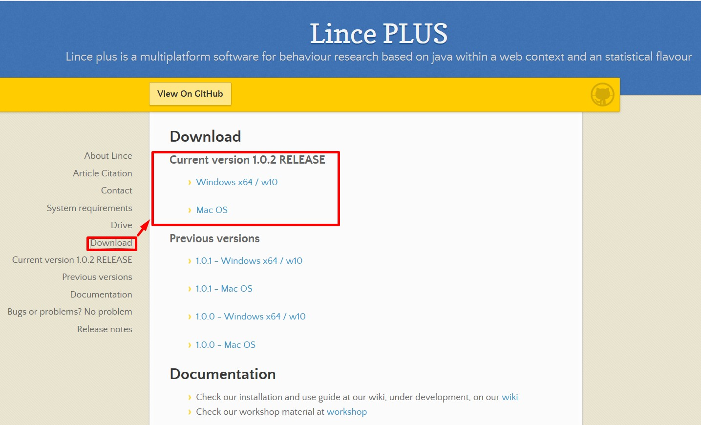

# LINCE PLUS Desktop (Español)

Welcome to LINCE PLUS Docs

## Installation and use manual


### Aplicación informática para la automatización de registros de observación

Lince es un proyecto gratuito y de código abierto que surge del entorno universitario para facilitar la investigación y la divulgación. Os damos las gracias por facilitar su difusión y su citación ya que sólo así podremos seguir haciendo crecer y evolucionar el producto.


Este software se ha desarrollado en el marco de los Proyectos: New approach of research in physical activity and sport from mixed methods perspective (Ministry of Science, Innovation, 2019-2021); Integración entre datos observacionales y datos provenientes de sensores externos: Evolución del software LINCE PLUS y desarrollo de la aplicación móvil para la optimización del deporte y la actividad física beneficiosa para la salud [EXP\_74847] (Ministerio de Cultura y Deporte, Consejo Superior de Deporte y la Unión Europea 2023). Research Projects in Science and Technology applied to Activity (CSD, 2023) y lo financia el Institut Nacional d’Educació Física de Catalunya (INEFC)

### Artículos científicos

- Soto, A, Camerino, O, Anguera, M.T., Iglesias, X., & Castañer, M., (2022): LINCE PLUS Software for Systematic Observation Studies of Sports and Health. Behavior Research Methods 54 , 1263–1271 , https://doi.org/10.3758/s13428-021-01642-1
- Soto, A., Camerino, O., Iglesias, X., Anguera, M. T., & Castañer, M. (2019). LINCE PLUS: Research Software for Behaviour Video Analysis. Apunts. Educación Física y Deportes, 137, 149-153. https://doi.org/10.5672/apunts.2014-0983.es.(2019/3).137.11


[](#trueinformation-about-lince-plus)Information about LINCE PLUS
-----------------------------------------------------------------

LINCE PLUS es un programa que evoluciona continuamente e incluye nuevas funciones que aumentan las necesidades del sistema, por lo que está diseñado para funcionar en ordenadores relativamente potentes.

[](#truesystem-requirements)System requirements
-----------------------------------------------

System requirements:

* Java 17 or higher, included in the software by default

* Mac OS, Linux or Windows


Desired system requirements:

* Windows 10 or Mac Os Catalina

* More than 4 GB RAM

* Java 17 or higher, bundled with the app

* Intel i5 (7a gen) or higher


LINCE PLUS ejecuta un servidor interno que exige más potencia de la prevista en versiones anteriores. Toda la información está totalmente protegida bajo los recursos de administración del sistema.


[](#truelince-plus-installation)Manual de instalación y uso de LINCE PLUS
-------------------------------------------------------

Esta información incluye los pasos iniciales para instalar y utilizar Lince Plus sin conocimientos previos.

LINCE PLUS puede descargarse del sitio web oficial [https://observesport.github.io/lince-plus/](https://observesport.github.io/lince-plus/)

Al acceder a la web se recomienda descargar la última versión disponible. Cada versión incluye nuevas funciones y corrige los problemas que señalan los usuarios. Para ver las distintas versiones y los cambios introducidos, haga clic en la sección "notas de la versión" del sitio web.




### [](#truewindows-installation)Instalación en Windows

Para instalar LINCE PLUS siga estas instrucciones:

* Visite el sitio web del repositorio Lince [http://observesport.github.io/lince-plus/](http://observesport.github.io/lince-plus/) para obtener el programa LINCE PLUS en la sección "descargas" haciendo clic en el enlace y ejecútelo. \*Si le aparece un mensaje de protección en windows 10, acéptalo y autorice la instalación. El software no es malicioso.
* Pulse "siguiente", "aceptar condiciones" e "instalar" para preparar el proceso de instalación (Figura 1). A continuación le preguntará si existe una versión anterior, y en este caso tiene que seleccionar "modificar" (Figura 2).
* If you get a protection message in windows 10, accept it and authorize the installation. The software is not malicious.


* Go by pressing "next", "accept conditions" and "install" to prepare the installation process. Then it will ask you if there is a previous version, and in this case you have to select "modify".


* Once accepted, the installation process begins. Proceed to the next screen.


Once you have installed the java version, the installer will finish with the installation of LINCE PLUS. Its icon will be placed your desktop for execution.

### Mac OS installation

* We are continuously building and improving the installer
* Due to license cost, MacOs Installer will be blocked on the first install
* YOU NEED TO ENABLE MAC OS EXTERNAL SOFTWARE to install LINCE PLUS, check image bellow
* For more information, please follow https://support.apple.com/en-us/HT202491


* The next step is to open the .zip file of Lince plus and execute directly.


##  Utilización de Lince Plus

En esta sección se explican las funciones de LINCE PLUS. Se recomienda leerla detenidamente y probar las acciones que se exponen en el propio programa para entender su funcionamiento.

Para ejecutar LINCE PLUS podemos hacer clic en el acceso directo del escritorio o buscarlo entre los programas utilizando el botón Inicio.

### Página principal

Para ejecutarlo, haga doble clic en el icono del escritorio y LINCE PLUS se iniciará en la pantalla de inicio (Figura 7).


LINCE PLUS ha sido diseñado pensando en la simplicidad para facilitar las tareas del usuario, pero, incluir el uso de tecnología web requiere que tengas en cuenta que tiene dos componentes: la aplicación de escritorio y el acceso web que la propia aplicación genera.

Para empezar a ejecutarlo, haz doble clic en el icono de lynx o en el ejecutable y verás la pantalla de carga.

### El entorno de Lince Plus

El entorno LINCE PLUS se divide en dos áreas diferenciadas:

- La aplicación de escritorio o servidor (Lince escritorio). Se encarga de guardar la información, gestionar los vídeos a observar y realizar todo tipo de importaciones o exportaciones. También se utiliza para gestionar los datos de registro.

- La aplicación web (Lince web). Sólo funciona si LINCE PLUS escritorio se está ejecutando. Realiza la interacción con los datos y el análisis de la investigación.

### La aplicación de escritorio

Desde esta aplicación se puede gestionar toda la información del proyecto y disponer de 4 áreas de trabajo (Figura 8):

- Zona de menús: Desde aquí puedes gestionar los proyectos de investigación, los vídeos seleccionados y gestionar la interacción con otras aplicaciones que puedas utilizar.

- Área de información: En esta zona hay un resumen del proyecto. Si alguien está conectado, puedes ver cómo cambian las escenas, los observadores u otros datos.

- Área para artículos: Cítenos con el enlace proporcionado y gracias de antemano.

- Zona inferior o pie de página: Puedes ver los mensajes del programa y en Windows cargará el último proyecto utilizado, además muestra el PUERTO en el que se está ejecutando. Este aspecto es de vital importancia y se detalla en el apartado "Primeros pasos con LINCE PLUS".


### La aplicación web

En la barra de herramientas de LINCE PLUS escritorio, seleccione "Ver" → "Abrir navegador" y se abrirá una pantalla de navegador.


En la barra superior de su navegador podrá detectar la dirección de acceso al portal web de Lince. La dirección será un valor similar al siguiente: http://192.168.1.10:555. Al observar la Figura 8, en la zona inferior se puede ver un valor llamado "puerto". Este valor, junto con la IP del ordenador, genera la dirección específica de acceso a la aplicación web (Figura 10).


En esta ventana del navegador se puede ver (Figura 10):

- Menú superior. Aquí se puede ver la versión en ejecución, el selector de idioma y modificar la información general del proyecto. En la parte superior derecha se puede encontrar una opción para elegir un observador. Estos aspectos se detallan en la sección "Primeros pasos con LINCE PLUS" y en la sección "Trabajo en grupo".

- Menú de la barra lateral. A través de los iconos de esta área se pueden seguir las diferentes etapas de la metodología de observación, comenzando por la creación del instrumento de observación y, a continuación, la selección de los momentos o episodios que se registrarán y analizarán, pasando a la fase de análisis. A partir de ahí, dispones de un sencillo motor gráfico que resume lo que has observado. Además de una sección específica para la interpretación de resultados, pudiendo programar sus resultados directamente con Rdirectly o encontrar la fiabilidad entre diferentes observadores estadísticamente.

Como pauta general, en cada pantalla hay una serie de iconos que permiten mover el panel, maximizar, minimizar o distribuir el área de trabajo. El icono superior derecho permite ampliar el panel a pantalla completa y, al volver a seleccionarlo, minimizarlo al tamaño original. El menú lateral puede ocultarse.

## Primeros pasos con LINCE PLUS

Cuando empiece a utilizar LINCE PLUS, debe tener claro el objetivo de su proyecto de investigación para poder generar una estructura válida del proceso. Lo primero que hay que tener en cuenta es lo siguiente:

- ¿Cuántos observadores participan en el proyecto?

- ¿Se ha construido el instrumento de observación?

- ¿Cuántos y qué vídeos veré? ¿Tienen la misma duración?

### Configuración del instrumento de observación

La construcción del instrumento de observación es la primera etapa del proceso. Puede proponerse tanto para diseños unidimensionales como multidimensionales.

La tipología del instrumento de observación incluye un sistema de categorías (habrá una dimensión o criterio), un formato de campo (habrá varias dimensiones o criterios y catálogos de conductas para cada uno de ellos), o un formato de campo combinado con sistemas de categorías (habrá varias dimensiones o criterios y sistemas de categorías o catálogos de conductas según las características de cada dimensión o criterio).

Con la opción CONFIGURAR del menú lateral izquierdo se puede generar la estructura del instrumento de observación, especificando primero los criterios / dimensiones y después las categorías /catálogos de comportamiento de forma muy sencilla, y ordenándolos intuitivamente mediante los iconos que se muestran en la imagen. Al pulsar el botón GUARDAR aparece un mensaje de confirmación.


Figura 11: Configuración del instrumento de observación

El instrumento de observación estará disponible para todos los usuarios conectados al mismo proyecto.

#### Configuración automática del instrumento de observación

LINCE PLUS le permite generar un instrumento automáticamente, creando las claves y codificándolo de forma rápida y sencilla. Recomendamos esta opción si desea avanzar rápidamente o preparar pruebas que desee editar más tarde. Para ello, hay que generar un instrumento vacío, como el de la imagen adjunta, y al guardarlo, introduce todos los campos automáticamente, llamándolos de forma secuencial.

Basta con seleccionar las opciones a añadir con el símbolo + y generar todos los criterios / dimensiones y categorías/comportamientos que se deseen sin introducir ningún texto o sólo los valores que interesen. Esta opción es muy útil si la denominación aún no es definitiva o si desea empezar directamente de forma totalmente inductiva. En la siguiente imagen puede ver el resultado generado.


Puede ver cómo al seleccionar GUARDAR la información se rellena automáticamente. A continuación, puede editar los valores deseados, pero sin olvidar GUARDAR antes de salir de esta opción.


### Selección de vídeos

LINCE PLUS te permite reproducir simultáneamente varios vídeos.

Para acceder a su selección debe utilizar la aplicación Lince escritorio. En el menú superior está la pestaña "Vídeo" → "Seleccionar vídeos". Si desea borrar toda la selección, también existe la opción para ello. En la parte inferior de la pantalla hay una pestaña llamada "Vídeos seleccionados" que contiene una selección actualizada. También puedes ver en "información del proyecto" cuántos vídeos están seleccionados.


En el selector de vídeo aparece la lista de formatos compatibles. Dado que LINCE PLUS utiliza el navegador web para reproducir vídeos, el formato de vídeo debe ser reproducible por el navegador del usuario. En caso de que se utilicen otros formatos, deberá convertirlo a un formato válido.


Si se muestran varios vídeos simultáneamente, asegúrese de que tienen la misma duración, de lo contrario LINCE PLUS no podrá saber qué marca temporal del vídeo desea utilizar para registrar.

Otro aspecto a tener en cuenta es el tamaño del vídeo. Todos los vídeos seleccionados se cargan simultáneamente en la memoria del ordenador. Si se seleccionan varios vídeos de 2 GB, el ordenador debe poder reproducirlos.

### Número de observadores

Si sólo hay un observador en el proyecto, no es necesario rellenar esta configuración y el programa actuará de forma transparente. Sin embargo, si participan 2 o más observadores, deberá especificarse desde el principio.


En el botón superior del entorno web hay una opción llamada "Información del proyecto". Es importante definir desde el principio cuántos observadores van a realizar la observación, y para ello debe rellenar los diferentes campos y luego seleccionar el botón de la parte superior derecha para "guardar todo".


Ahora hay que navegar a otra opción para actualizar la página y seleccionar el botón derecho en la barra superior y seleccionar "Cambiar Observador".

Para cambiar de observador, seleccione uno y márquelo como activo. Le mostrará los registros contenidos que ha hecho analizar y las marcas temporales.


### Información sobre el proyecto

Una vez configurados los vídeos y la información del proyecto, le recomendamos que guarde el proyecto para evitar perder datos. Para ello, seleccione la opción Proyecto → Guardar como


Al cerrar Lince Escritorio le pedirá que guarde el proyecto, aunque se recomienda seguir guardándolo continuamente.

En el entorno Windows, la próxima vez que se inicie LINCE PLUS, se cargará automáticamente el último proyecto guardado. Esta opción es muy útil para seguir trabajando en la misma investigación.

Si tiene un proyecto creado con Lince 1.4 o anterior, también puede incluirlo en su investigación con el archivo de registro o con el archivo de instrumento. Puede verlo en detalle en la sección de "importación y exportación a herramientas externas".

### Delimitación de los episodios de observación

La delimitación de episodios es una nueva función que permite establecer el muestreo observacional para materializarlo. Los vídeos se previsualizan. En ese momento puede seleccionar lo que quiere observar e incluir comentarios adicionales.

A esta opción se accede desde la sección "Escenas" del menú lateral. Antes, debe haber seleccionado los vídeos que desea registrar.


En este reproductor hay varias áreas de trabajo:

- Un reproductor de vídeo sincronizado que reproducirá simultáneamente todos los vídeos incluidos. El botón SYNC permite sincronizar los vídeos en el mismo momento de reproducción que en el primer vídeo. También puedes controlar la velocidad de reproducción de todos los vídeos.

- Un control individual para cada vídeo, que permite controlar todos los aspectos, incluida la velocidad de reproducción.

- La opción de seleccionar cuántos vídeos se quieren ver juntos y cambiar su disposición y tamaño predeterminado.

- Un menú de episodios detectados. En cada episodio se puede:

  - Reproducir: Un botón rojo que reproduce instantáneamente el tiempo de vídeo que se ha guardado.
  - Editar: Un botón de edición para añadir un comentario.
  - Borrar: Permite eliminar la escena introducida y los registros observados que contiene


### Análisis

Esta opción es la principal área de trabajo para la observación. Se ha diseñado para simplificarlo al máximo y para que sea similar a la versión anterior de Lince. Se encuentran todos los episodios introducidos previamente con los registros observados.


En esta pantalla se muestran varias secciones:

- Zona de reproducción: El reproductor tiene las mismas condiciones que el anterior y en la zona lateral derecha se ve el instrumento de observación.

- Zona de inscripción: Todos los episodios seleccionados se muestran con los valores de observación registrados. Puede ordenar y editar todos los valores. Si desea modificar una observación, pulse el botón rojo y fije la nueva observación en el área del instrumento. Guarde los datos para mantenerlos actualizados sin modificar su calendario.

- Zona de instrumentos: Aquí puede marcar lo que se observa en los vídeos. Al guardar un nuevo episodio se genera e introduce la marca temporal del primer vídeo, similar a la de los episodios.

- Zona de adaptación: Son controles que permiten adaptar el área de trabajo para vídeos e instrumentos, cambiando el tamaño y con una línea vertical que se puede mover.

### Tablas de registro

Esta opción muestra su registro visualmente mediante gráficos sencillos. En el siguiente ejemplo puede ver cómo hay un momento en el que todavía no se ha registrado ninguna observación en el episodio 24,18.


Puede comprobar visualmente los elementos del instrumento de observación en porcentajes y tendencias en los distintos episodios del registro.

### DAnálisis de datos

LINCE PLUS facilita el cálculo automático de los resultados sin necesidad de utilizar herramientas externas, ya sea mediante el uso del lenguaje de programación R o mediante la comparación automática de varios observadores para el cálculo del índice de concordancia, incluido el control de calidad de los datos.

#### Estadísticas

#### Resultados estadísticos con R

Esta es una de las grandes novedades de LINCE PLUS, ya que a partir de ahora se incluye un motor de lenguaje R. Si navega a la opción R-console hay un componente que le permite calcular los resultados deseados para su análisis.


Para poder utilizarlo correctamente es necesario tener conocimientos del lenguaje de programación R.

- En el área de la izquierda hay una zona para introducir el código fuente y un botón para ejecutarlo. En el área superior están las variables que se cargan en el contexto de ejecución de R desde Lince y que puedes utilizar en tu código. Al pulsar EJECUTAR se mostrará el panel de resultados.

- En la zona derecha puede ver el texto con los resultados de su cálculo.

- En la zona inferior hay una sección de AYUDA para ampliar la información con algunos consejos.

Los gráficos de R no están incluidos, pero se puede acceder a ellos directamente desde R-Studio. Puede consultar la sección de características especiales para ello.

A diferencia de R, necesitamos que introduzca ";" al final de cada línea. En R-Studio no es obligatorio.

**print(linceDataByCategory);**

Este código le muestra en pantalla la matriz del registro dividida por categorías. Puedes observar el tiempo en ms y el fotograma exacto basado en 21 fps.


La intención de Lince Plus es que esta opción pueda ser utilizada por expertos.

#### Cálculo de la concordancia entre varios observadores

Si en el proyecto participan varios observadores, LINCE PLUS le permite calcular la concordancia entre los diferentes observadores y saber si son concordantes en el registro de los mismos aspectos en la observación, pudiendo calcular los índices de concordancia mediante Kappa o Krippendorf y generar la matriz de contingencia entre sus observaciones.

Para su cálculo, los observadores deben tener los mismos episodios, número de episodios y un registro independiente de cada uno de ellos.


Cómo realizar el cálculo:

1. En el menú de la izquierda, seleccione el botón "+" para previsualizar el registro del observador. Puede seleccionar varias veces y ver cómo el color cambia de verde a blanco. Cuando está verde, el observador está seleccionado.

1. Seleccione otro observador y acceda al resultado deseado en el menú superior

1. En "Calcular resultados", seleccione la opción deseada (Kappa, coeficiente de Krippendorf...)

1. Pulse EJECUTAR para visualizar el resultado.

Las futuras versiones de LINCE PLUS le obligarán a registrar episodios idénticos.

## Importación y exportación de datos

LINCE PLUS permite integrar registros externos y otras aplicaciones.


Importar

- Hoisan

- Instrumento y registro de Lince 1

- Importe un proyecto LINCE PLUS externo. Permite abrir proyectos de otros ordenadores sin modificar los vídeos seleccionados.

- Importar un registro de observación externo. Esta opción genera un nuevo observador.


Exportar

- Temas 5 y 6

- Excel, utilizando CSV con el separador ";" o "," para todos los sistemas

- SAS

- GSEQ

- Lince 1, tanto el instrumento como el registro.


## Conexión de otros dispositivos

Puedes utilizar Lince escritorio en su ordenador y ver sus vídeos cómodamente desde otro dispositivo o tablet. En smartphone también, pero la cantidad de información que manejará no será cómoda de usar.

El acceso remoto es muy sencillo, ya que sólo tiene que acceder a la dirección de su máquina con el puerto que tenga:

- La dirección de su máquina es su valor ip. Para descubrirlo, acceda a la sección "Descubra su ip"

- El puerto es informado cada vez que se inicia LINCE PLUS y siempre cambia por motivos de seguridad.

La dirección que debe abrir en su navegador es similar a la siguiente:

[http://10.0.75.1:53715](http://10.0.75.1:53715)

```markdown
- http://{IP}:{PUERTO}
- Example: http://10.0.75.1:53715
- Si tiene dudas sobre cómo conectarse consulte la sección "descubra su IP"
```

El puerto se informa en la aplicación, en el marco inferior justo al arrancar.


## Trabajo en equipo

LINCE PLUS permite un amplio abanico de posibilidades bajo un sistema de trabajo sencillo y, sobre todo, permitiendo la colaboración simultánea de varios investigadores.

He aquí algunos de estos aspectos: - Cada observador generado en la sección "Información del proyecto" genera un nuevo perfil de observador. - Cada observador tiene un registro de observación, independiente del resto.

Esto le permite realizar observaciones simultáneas con varios observadores, generando varios escenarios:

- Varios investigadores trabajando al mismo tiempo con cada observador en diferentes zonas horarias del vídeo para acelerar el trabajo. Esto facilita la observación del vídeo dividiendo el trabajo a realizar.

- Si generamos varios observadores, cada uno de ellos puede intentar observar los mismos episodios y los mismos detalles, para analizar posteriormente si cada observador visualiza los mismos detalles calculando su índice de concordancia.

- Generar varios observadores, que pueden registrar diferentes detalles del vídeo. Un ejemplo sería analizar una competición en la que participan 2 equipos, de modo que cada observador registre a uno de los equipos.

Todo esto puede hacerse simultáneamente gracias al trabajo en colaboración.


Si tiene dudas sobre cómo conectarse, consulte la sección "Descubra su IP"

## Conexión de R Studio a Lince plus

Si desea más potencia estadística, o generar informes con gráficos más complejos, puede conectar R Studio a Lince. Para ello puede seguir los consejos del apartado "Consola R" en la interfaz web.

En resumen, el proceso es el siguiente:

- En primer lugar, instale las herramientas de desarrollo en R-studio utilizando el siguiente comando en una ventana de diálogo. Este proceso puede durar unos minutos.

install.packages("devtools")

- A continuación, compruebe que funciona correctamente con el siguiente ejemplo:

```bash
library(jsonlite)
hadley_orgs <- fromJSON("https://api.github.com/users/hadley/orgs")
print(hadley_orgs)
```

Esto permite conectarse a una página web externa y consultar datos, generando la variable 'hadley\_orgs', con los datos de la api rest.

- A continuación nos conectaremos a LINCE PLUS, para ello puede acceder a la sección 5 de la consola de R o conectarse directamente al siguiente código cambiando el puerto con el que le informa la aplicación LINCE PLUS como se muestra en la imagen.

```bash
library(jsonlite)
lince_data <- fromJSON("http://localhost:53715/register/get")
print(lince_data)
```

Observe en la imagen como el número "53715" coincide con el registrado en la aplicación Lince escritorio.


**Problemas durante la instalación del programa**

Si se produce alguna incompatibilidad o problema al iniciar Lince Plus, probablemente se deba a la incompatibilidad de la versión de java.

En este caso, se recomienda comprobar la versión de java y realizar la instalación manualmente. Para ello, haremos lo siguiente:


- Windows: En el icono de windows, buscaremos 'ejecutar'. También puedes pulsar "tecla windows +r ". Introduzca " cmd " y abra un terminal.

- MacOs: Con la tecla cmd + espacio se abre un asistente. Introduzca " terminal " y haga clic en el resultado.

En ambos sistemas, se abre una pantalla de texto oscuro. En esta pantalla introduzca "java -version".

Sabrá si está bien instalado o no.


Si no reconoce el resultado, es porque no está instalado.

**Descubra su IP**

La ip es un identificador de su ordenador y cambia en cada red a la que se conecta. Si trabaja en la oficina y en casa, tendrá IP diferentes.

Para saber qué ip tiene, abra un terminal (se detalla en el apartado anterior), e introduzca el siguiente valor:

- En el caso de windows " ipconfig "

- En caso de macOS o linux " ifconfig "


Su ip de acceso puede ser compartida con otros dispositivos o con otros usuarios para iniciar un trabajo colaborativo. En el caso de la imagen, se accedería a través de la siguiente dirección

```bash
https://192.168.0.20:53715
```


