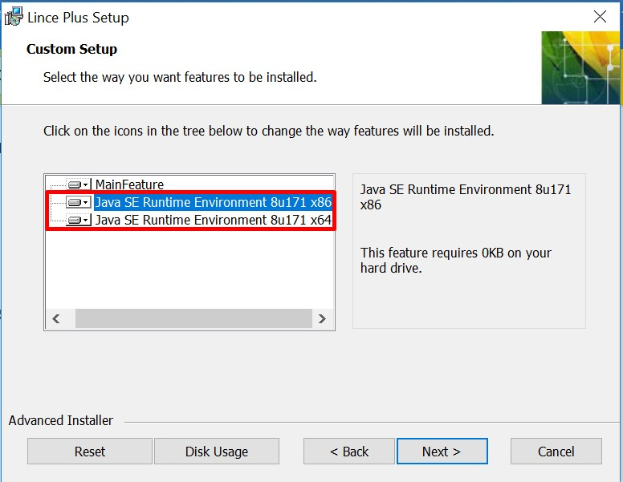
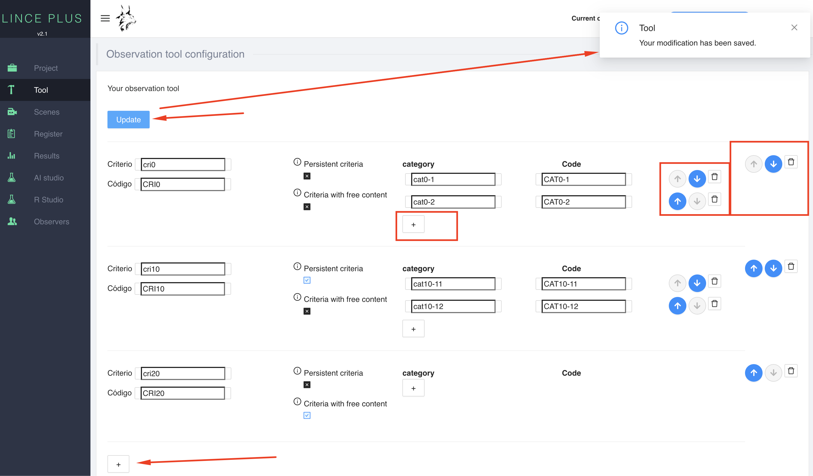
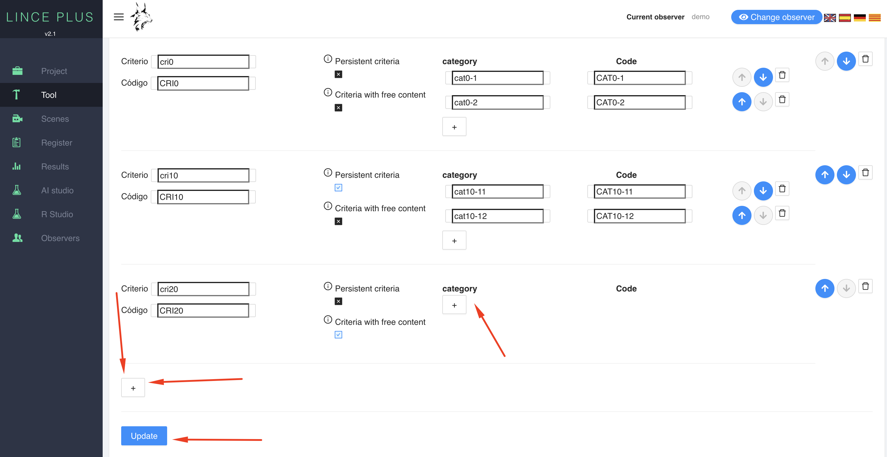
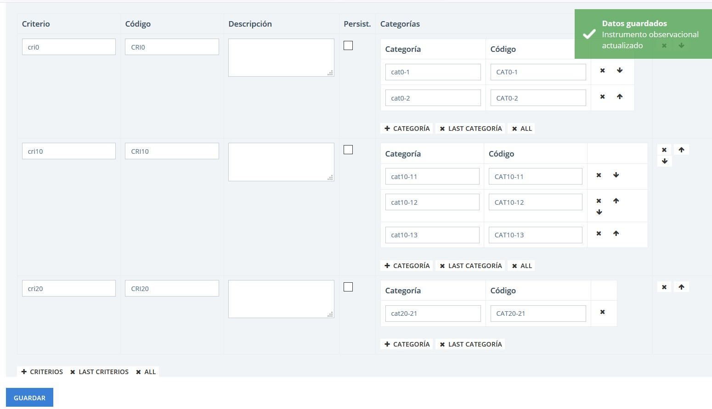
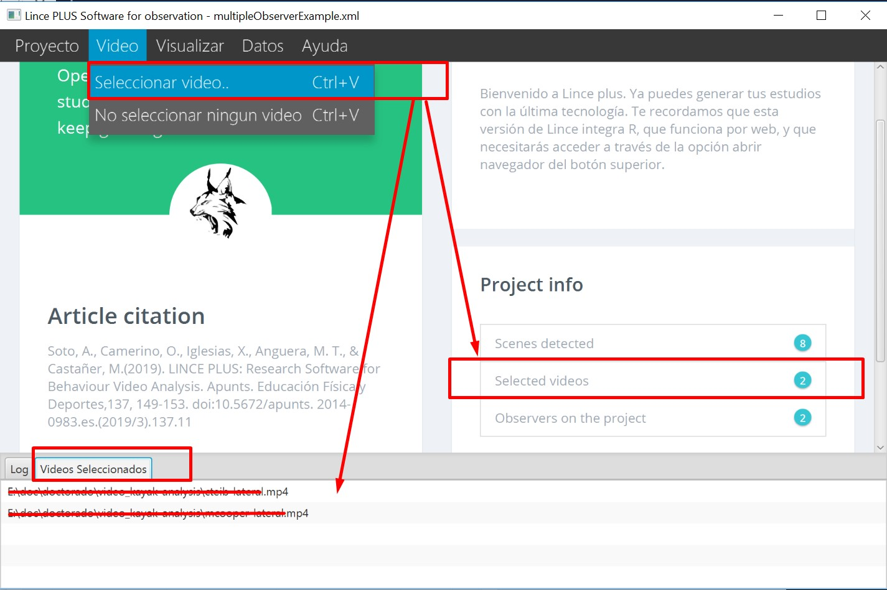
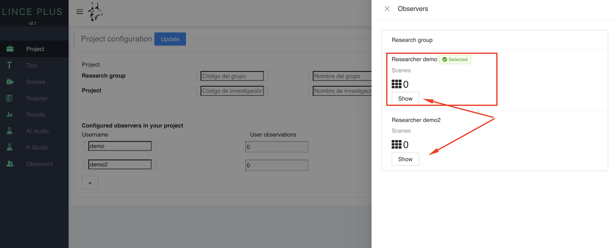
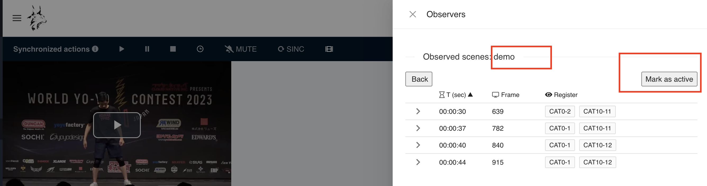
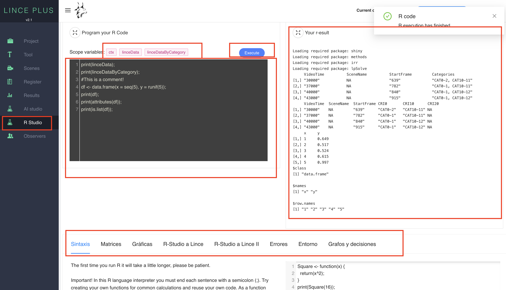
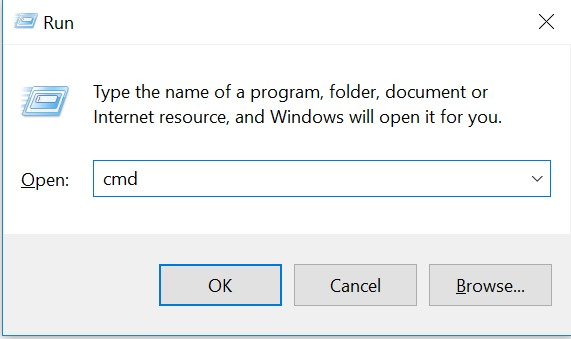
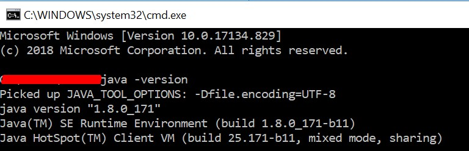

# LINCE PLUS Desktop

Welcome to LINCE PLUS Docs

## Installation and use manual


### Application informatique pour l’automatisation des enregistrements d’observation

Lince est un projet libre et gratuit qui émerge de l’environnement universitaire pour faciliter la recherche et la diffusion. Nous vous remercions de faciliter sa diffusion et sa citation, car ce n’est qu’ainsi que nous pourrons continuer à développer et à faire évoluer le produit.


Ce logiciel a été développé dans le cadre des projets : Nouvelle approche de la recherche dans le domaine de l’activité physique et du sport du point de vue des méthodes mixtes (ministère de la Science, de l’Innovation, 2019-2021) ; Intégration entre données observationnelles et données provenant de capteurs externes : Évolution du logiciel LINCE PLUS et développement de l’application mobile pour l’optimisation du sport et de l’activité physique bénéfique pour la santé [EXP\_74847] (ministère de la Culture et du Sport, Conseil supérieur du sport et Union européenne. 2023). Projets de recherche en sciences et technologies appliquées à l’activité (CSD, 2023) et financé par l’Institut national d’éducation physique de Catalogne (INEFC)

### Articles scientifiques

- Soto, A, Camerino, O, Anguera, M.T., Iglesias, X., & Castañer, M., (2022): LINCE PLUS Software for Systematic Observation Studies of Sports and Health. Behavior Research Methods 54 , 1263–1271 , https://doi.org/10.3758/s13428-021-01642-1
- Soto, A., Camerino, O., Iglesias, X., Anguera, M. T., & Castañer, M. (2019). LINCE PLUS: Research Software for Behaviour Video Analysis. Apunts. Educación Física y Deportes, 137, 149-153. https://doi.org/10.5672/apunts.2014-0983.es.(2019/3).137.11


[](#trueinformation-about-lince-plus)Informations sur LINCE PLUS
-----------------------------------------------------------------

LINCE PLUS est un programme qui évolue continuellement et inclut de nouvelles fonctionnalités qui augmentent les besoins du système, il est donc conçu pour fonctionner sur des ordinateurs relativement puissants.

[](#truesystem-requirements)Exigences du système
-----------------------------------------------

System requirements:

* Java 17 or higher, included in the software by default

* Mac OS, Linux or Windows


Exigences souhaitées en matière de système :

* Windows 10 or Mac Os Catalina

* More than 4 GB RAM

* Java 17 or higher, bundled with the app

* Intel i5 (7a gen) or higher


LINCE PLUS fait fonctionner un serveur interne qui demande plus de puissance de calcul que les versions précédentes. Toutes les informations sont totalement protégées sous les ressources d’administration du système.


[](#truelince-plus-installation)Manuel d’installation et d’utilisation de LINCE PLUS
-------------------------------------------------------

Ces informations comprennent les premières étapes de l’installation et de l’utilisation de LINCE PLUS sans connaissances préalables.

LINCE PLUS peut être téléchargé sur le site officiel [https://observesport.github.io/lince-plus/](https://observesport.github.io/lince-plus/)

Lors de l’accès au site web, il est recommandé de télécharger la dernière version disponible. Chaque version comprend de nouvelles fonctionnalités et corrige les problèmes signalés par différents utilisateurs. Pour voir les différentes versions et les modifications introduites, cliquez sur la section « notes de mise à jour » du site web.


### [](#truewindows-installation)Installation sous Windows


Pour installer LINCE PLUS, suivez ces instructions :

* Visitez le site web de Lince http://observesport.github.io/lince-plus/ pour obtenir le programme LINCE PLUS dans la section « téléchargements » en cliquant sur le lien et exécutez-le. \*Si vous obtenez un message de protection dans Windows 10, acceptez-le et autorisez l’installation. Le logiciel n’est pas malveillant.
* Appuyez sur « suivant », « accepter les conditions » et « installer » pour préparer le processus d’installation (Figure 1). Il vous demandera ensuite s’il existe une version antérieure et, dans ce cas, vous devrez sélectionner « modifier » (Figure 2).


* Dans cette version, vous devez utiliser au moins Java 1.8. Faites la sélection appropriée ou le système téléchargera automatiquement la version dans le système (Figures 3 et 4).


* Une fois accepté, le processus d’installation commence. Passez à l’écran suivant.





Une fois la version Java installée, le programme d’installation termine l’installation de LINCE PLUS. Son icône sera placée sur votre bureau pour exécution.

### Installation sous Mac OS

* We are continuously building and improving the installer
* Due to license cost, MacOs Installer will be blocked on the first install
* YOU NEED TO ENABLE MAC OS EXTERNAL SOFTWARE to install LINCE PLUS, check image bellow
* For more information, please follow https://support.apple.com/en-us/HT202491


* The next step is to open the .zip file of Lince plus and execute directly.


## Utilisation de LINCE PLUS

Dans cette section, nous expliquons les fonctions de LINCE PLUS. Nous conseillons de les lire attentivement et de tester les actions exposées dans le programme pour comprendre son fonctionnement.

Pour exécuter LINCE PLUS, vous pouvez cliquer sur le raccourci du bureau ou le rechercher parmi les programmes en utilisant le bouton Démarrer.

### Page principale

Pour l’exécuter, double-cliquez sur l’icône du bureau et LINCE PLUS démarrera sur l’écran de démarrage (Figure 7).


LINCE PLUS a été conçu pour faciliter les tâches de l’utilisateur, mais l’utilisation de la technologie web exige que vous gardiez à l’esprit qu’il y a deux composantes : l’application de bureau et l’accès au site web que la propre application génère.

Pour commencer à l’exécuter, double-cliquez sur l’icône de Lynx ou sur l’exécutable et vous verrez l’écran de chargement.

### L’environnement de LINCE PLUS

L’environnement LINCE PLUS est divisé en deux zones distinctes :

- L’application de bureau ou de serveur (Lince desktop). Elle est chargée de sauvegarder les informations, de gérer les vidéos à observer et d’effectuer toutes sortes d’importations ou d’exportations, ainsi que de gérer les données d’enregistrement.

- L’application web (Lince web). Elle ne fonctionne que si le bureau LINCE PLUS est en cours d’exécution. Elle effectue l’interaction avec les données et l’analyse de l’enquête.

### L’application de bureau

À partir de cette application, vous pouvez gérer toutes les informations relatives au projet et disposer de quatre zones de travail (Figure 8) :

- Zone de menu : Vous pouvez gérer ici les projets de recherche, les vidéos sélectionnées et l’interaction avec d’autres applications que vous pouvez utiliser.

- Espace d’information : Cette zone contient un résumé du projet. Si quelqu’un est connecté, vous pouvez voir comment les scènes, les observateurs ou d’autres données changent.

- Espace de l’article : Citez-nous avec le lien fourni et merci d’avance.

- Zone inférieure ou pied de page : Vous pouvez voir les messages du programme et, sous Windows, il chargera le dernier projet utilisé, en plus d’afficher le PORT dans lequel il est exécuté. Cet aspect est d’une importance vitale et est détaillé dans la section « premiers pas avec LINCE PLUS ».


### L’application web

Dans la barre d’outils du bureau LINCE PLUS, sélectionnez « Voir » → « Ouvrir le navigateur » et un écran de navigation s’ouvrira.


Dans la barre supérieure de votre navigateur, vous trouverez l’adresse d’accès au portail web de Lince. L’adresse sera une valeur similaire à la suivante : http://192.168.1.10:555. Si vous regardez la Figure 8, dans la partie inférieure, vous pouvez voir une valeur appelée « port ». Cette valeur, associée à l’IP de l’ordinateur, génère l’adresse d’accès spécifique à l’application web (Figure 10).


Dans cette fenêtre du navigateur, vous pouvez voir (Figure 10) :

- Menu supérieur. Ici, vous pouvez voir la version en cours, le sélecteur de langue et modifier les informations générales du projet. En haut à droite, vous pouvez voir une option pour choisir l’observateur. Ces aspects sont détaillés dans la section « Premiers pas avec LINCE PLUS » et dans la section « Travail en groupe ».

- Menu latéral. Les icônes de cette zone vous permettent de suivre les différentes étapes de la méthodologie d’observation, en commençant par la création de l’instrument d’observation, puis la sélection des moments ou des épisodes à enregistrer et à analyser, jusqu’à la phase d’analyse. De là, vous disposez d’un moteur graphique simple qui résume ce que vous avez observé. Ainsi qu’une section spécifique pour l’interprétation des résultats, la possibilité de programmer vos résultats directement avec R et la recherche statistique de la fiabilité entre différents observateurs.

En règle générale, chaque écran comporte une série d’icônes qui permettent de déplacer le panneau, de maximiser, de minimiser ou de répartir la zone de travail. L’icône en haut à droite vous permet d’agrandir le panneau en plein écran et, lorsque vous le sélectionnez à nouveau, de le réduire à sa taille d’origine. Le menu latéral peut être masqué.

## Premiers pas avec LINCE PLUS

Lorsque vous commencez à utiliser LINCE PLUS, vous devez être clair sur l’objectif de votre projet de recherche afin de pouvoir générer une structure valide du processus. Les premiers éléments à prendre en compte sont les suivants :

- Combien d’observateurs participent au projet ?

- L’instrument d’observation a-t-il été construit ?

- Combien de vidéos vais-je visionner et lesquelles ? Ont-elles la même durée ?

### Configuration de l’instrument d’observation

La construction de l’instrument d’observation est la première étape du processus. Elle peut être proposée pour les dessins unidimensionnels et multidimensionnels.

La typologie de l’instrument d’observation comprend un système de catégories (il y aura une dimension ou un critère), un format de champ (il y aura plusieurs dimensions ou critères et des catalogues de comportements pour chacun d’entre eux), ou un format de champ combiné à des systèmes de catégories (il y aura plusieurs dimensions ou critères et des systèmes de catégories ou des catalogues de comportements en fonction des caractéristiques de chaque dimension ou critère).

L’option CONFIGURER du menu de gauche permet de générer la structure de l’instrument d’observation, en spécifiant d’abord les critères/dimensions, puis les catégories/catalogues de comportement très facilement, et en les triant intuitivement à l’aide des icônes présentées dans l’image. En appuyant sur le bouton SAUVEGARDER, un message de confirmation s’affiche.



Figure 11 : Configuration de l’instrument d’observation

L’instrument d’observation sera disponible pour tous les utilisateurs connectés au même projet.

#### Configuration automatique de l’instrument d’observation

LINCE PLUS vous permet de générer automatiquement un instrument, en créant les clés et en le codant rapidement et facilement. Nous vous recommandons cette option si vous souhaitez avancer rapidement ou préparer des tests que vous souhaitez modifier ultérieurement. Pour ce faire, un instrument vide doit être généré, comme celui de l’image ci-jointe, et lors de l’enregistrement, il entre automatiquement dans tous les champs, en les appelant séquentiellement.

Il suffit de sélectionner les options à ajouter à l’aide du symbole + et de générer tous les critères/dimensions et catégories/comportements souhaités sans saisir de texte ou uniquement les valeurs qui vous intéressent. Cette option est très utile si la dénomination n’est pas encore définitive ou si vous voulez commencer directement de manière totalement inductive. L’image suivante montre le résultat généré.



Vous remarquerez qu’en sélectionnant SAUVEGARDER, les informations sont automatiquement complétées. Ensuite, vous pouvez modifier les valeurs souhaitées, mais sans oublier de SAUVEGARDER avant de quitter cette option.



### Sélection de vidéos

LINCE PLUS vous permet de reproduire simultanément plusieurs vidéos.

Pour accéder à votre sélection, vous devez utiliser l’application de bureau Lince. Dans le menu supérieur, vous trouverez l’onglet « Vidéo » → « Sélectionner des vidéos ». Si vous souhaitez supprimer la totalité de la sélection, vous avez également la possibilité de le faire. En bas de l’écran, un onglet intitulé « Vidéos sélectionnées » contient une sélection actualisée. Vous pouvez également voir dans « info projet » combien de vidéos sont sélectionnées.



La liste des formats pris en charge s’affiche dans le sélecteur vidéo. Étant donné que LINCE PLUS utilise le navigateur web pour la lecture des vidéos, le format vidéo doit pouvoir être reproduit par le navigateur de l’utilisateur. Si d’autres formats sont utilisés, vous devez les convertir dans un format valide.


Si plusieurs vidéos sont diffusées simultanément, veillez à ce qu’elles aient la même durée, sinon LINCE PLUS ne pourra pas savoir quelle marque temporaire de la vidéo vous souhaitez utiliser pour l’enregistrement.

Un autre aspect à prendre en compte est la taille de la vidéo. Toutes les vidéos sélectionnées sont chargées simultanément dans la mémoire de l’ordinateur. Si plusieurs vidéos de 2 Go sont sélectionnées, l’ordinateur doit pouvoir les lire.

### Nombre d’observateurs

S’il n’y a qu’un seul observateur dans le projet, il n’est pas nécessaire de remplir cette configuration, et le programme agira de manière transparente. Toutefois, si 2 observateurs ou plus participent, cela doit être spécifié dès le départ.


Le bouton supérieur de l’environnement web contient une option intitulée « Informations sur le projet ». Il est important de définir dès le départ le nombre d’observateurs qui vont effectuer l’observation, et vous devez remplir les différents champs, puis sélectionner le bouton en haut à droite pour « tout enregistrer ».



Vous devez maintenant naviguer vers une autre option pour mettre à jour la page et sélectionner le bouton droit dans la barre supérieure et sélectionner « Changer d’observateur ».

Pour changer d’observateur, sélectionnez-en un et marquez-le comme actif. Vous verrez les enregistrements contenus que vous avez fait analyser et les marques temporaires.



### Informations sur le projet

Une fois que nous avons configuré les vidéos et défini les informations relatives au projet, nous vous recommandons de sauvegarder votre projet pour éviter de perdre des données. Pour ce faire, sélectionnez l’option « Projet » → « Enregistrer sous »


Lorsque vous fermerez Lince Desktop, il vous sera demandé de sauvegarder le projet, bien qu’il soit recommandé de sauvegarder régulièrement le projet.

Dans l’environnement Windows, lors du prochain démarrage de LINCE PLUS, le dernier projet sauvegardé sera chargé automatiquement. Cette option est très utile pour continuer à travailler sur la même recherche.

Si vous avez un projet construit sous Lince 1.4 ou une version antérieure, il est également possible de l’inclure dans votre recherche avec le fichier d’enregistrement ou avec le fichier d’instrument. Vous pouvez voir cela en détail dans la section « Importer et exporter vers des outils externes ».

### Délimitation des épisodes d’observation

La délimitation des épisodes est une nouvelle fonctionnalité qui vous permet de matérialiser l’échantillonnage d’observation. Les vidéos sont prévisualisées, ce qui vous permet de sélectionner ce que vous voulez observer et d’ajouter des commentaires.

Cette option est accessible dans la section « Scènes » du menu latéral. Auparavant, vous devez avoir choisi les vidéos sélectionnées pour l’enregistrement.


Dans ce lecteur, il y a plusieurs zones de travail :

- Un lecteur vidéo synchronisé qui lira simultanément toutes les vidéos incluses. Le bouton SYNC permet de synchroniser les vidéos sur le même moment de lecture que la première vidéo. Vous pouvez également contrôler la vitesse de lecture de toutes les vidéos.

- Une commande individuelle pour chaque vidéo, qui vous permet de contrôler tous les aspects, y compris la vitesse de lecture.

- Un sélecteur du nombre de vidéos que vous souhaitez visionner ensemble et modifier la disposition et la taille par défaut.

- Un menu d’épisodes détectés. Dans chaque épisode, vous pouvez :

  - Lire : Un bouton rouge qui lit instantanément la durée de la vidéo qui a été sauvegardée.
  - Modifier : Un bouton de modification pour ajouter un commentaire.
  - Supprimer : Permet de supprimer la scène saisie et les enregistrements observés qu’elle contient

### Analyse

Cette option est la principale zone de travail pour l’observation. Elle a été conçue pour être très simple d’utilisation et être similaire à la version précédente de Lince. Tous les épisodes introduits précédemment avec les enregistrements observés sont présents.


Dans cet écran, plusieurs sections s’affichent :

- Zone de lecteur : Le lecteur a les mêmes conditions que le lecteur précédent et dans la zone latérale droite vous verrez l’instrument d’observation.

- Zone d’enregistrement : Tous les épisodes sélectionnés sont affichés avec les valeurs d’observation enregistrées. Vous pouvez commander et modifier toutes les valeurs. Si vous souhaitez modifier une observation, appuyez sur le bouton rouge et définissez la nouvelle observation dans la zone de l’instrument. Sauvegarder les données pour conserver les changements sans modifier votre calendrier.

- Zone de l’instrument : Ici, vous pouvez indiquer ce qui est observé dans les vidéos. Lors de l’enregistrement d’un nouvel épisode, cela génère et introduit la marque temporaire de la première vidéo, similaire à celle des épisodes.

- Zone d’adaptation : Il s’agit de commandes qui vous permettent d’adapter la zone de travail à la vidéo et à l’instrument, en changeant la taille et en vous déplaçant à l’aide d’une ligne verticale.

### Graphiques de registre

Cette option permet de visualiser votre registre à l’aide de graphiques simples. Dans l’exemple suivant, vous pouvez voir qu’il y a un moment où aucune observation n’a encore été enregistrée dans l’épisode 24,18.


Vous pouvez vérifier visuellement les éléments de l’instrument d’observation dans les pourcentages et les tendances des différents épisodes de l’enregistrement.

### Analyse des données

LINCE PLUS facilite le calcul automatique des résultats sans utiliser d’outils externes, soit par l’utilisation du langage de programmation R, soit par la comparaison automatique de plusieurs observateurs pour le calcul de l’indice de concordance, y compris le contrôle de la qualité des données.

#### Statistiques

#### Résultats statistiques à l’aide de R

C’est l’une des grandes nouveautés de LINCE PLUS, car un moteur de langage R est désormais inclus. Si vous naviguez vers l’option R-console, vous trouverez une composante qui vous permet de calculer les résultats souhaités pour votre analyse.



Pour pouvoir l’utiliser correctement, vous devez connaître le langage de programmation R.

- Dans la partie gauche, vous trouverez une zone pour entrer votre code source et un bouton pour l’exécuter. Dans la zone supérieure se trouvent les variables qui sont chargées dans le contexte d’exécution R à partir de Lince et que vous pouvez utiliser dans votre code. En appuyant sur EXÉCUTER, le volet des résultats s’affiche.

- Dans la partie droite, vous pouvez voir le texte avec les résultats de votre calcul.

- Dans la partie inférieure, une section AIDE permet d’enrichir l’information de quelques conseils.

Les graphiques de R ne sont pas inclus, mais sont accessibles directement à partir de R-Studio. Vous pouvez consulter la section des caractéristiques spéciales pour cela.

Contrairement à R, vous devez saisir « ; » à la fin de chaque ligne. Dans R-Studio, ce n’est pas obligatoire.

**print(linceDataByCategory);**

Ce code affiche à l’écran la matrice de l’enregistrement divisée par catégories. Vous pouvez observer le temps en ms et l’image exacte sur la base de 21 images par seconde.


L’objectif de LINCE PLUS est que cette option puisse être utilisée par des experts.

#### Calcul de l’accord entre plusieurs observateurs

Si plusieurs observateurs participent au projet, LINCE PLUS vous permet de calculer l’accord entre les différents observateurs et de savoir s’ils sont concordants dans l’enregistrement des mêmes aspects de l’observation, en pouvant calculer les taux d’accord par Kappa ou Krippendorf et générer la matrice de contingence entre vos observations.

Pour son calcul, les observateurs doivent avoir les mêmes épisodes, le même nombre d’épisodes et un enregistrement indépendant de chacun d’entre eux.


Comment effectuer le calcul :

1. Dans le menu de gauche, sélectionnez le bouton « + » pour prévisualiser l’enregistrement de l’observateur. Vous pouvez sélectionner plusieurs fois et voir comment la couleur passe du vert au blanc. Lorsqu’il est vert, l’observateur est sélectionné.

1. Sélectionnez un autre observateur et accédez au résultat souhaité dans le menu supérieur

1. Dans « Calculer les résultats », sélectionnez l’option souhaitée (Kappa, coefficient de Krippendorff, etc.).

1. Appuyez sur EXÉCUTER pour visualiser le résultat.

Les prochaines versions de LINCE PLUS vous obligeront à enregistrer des épisodes identiques.

## Importation et exportation de données

LINCE PLUS permet l’intégration de registres externes et d’autres applications.


Importation

- Hoisan

- Instrument et enregistrement de Lince 1

- Importer un projet LINCE PLUS externe. Cela vous permet d’ouvrir des projets provenant d’autres ordinateurs sans modifier les vidéos sélectionnées.

- Importer un enregistrement d’observation externe. Cette option génère un nouvel observateur.


Exportation

- Thème 5 et 6

- Excel, en utilisant CSV avec le séparateur « ; » ou « , » pour tous les systèmes

- SAS

- GSEQ

- Lince 1, à la fois instrument et enregistrement.

## Connexion d’autres appareils

Vous pouvez utiliser Lince desktop sur votre ordinateur et visionner vos vidéos confortablement depuis un autre appareil ou une tablette. Ainsi que sur votre smartphone, mais la quantité d’informations qu’il permettra de gérer ne sera pas confortable à utiliser.

L’accès à distance est très simple, puisqu’il suffit d’accéder à la direction de votre appareil avec le port dont vous disposez :

L’adresse de votre appareil est votre valeur IP. Pour le découvrir, accédez à la section « Découvrez votre IP ».

Le port est informé à chaque démarrage de LINCE PLUS et change toujours pour des raisons de sécurité.

L’adresse que vous devez ouvrir dans votre navigateur est similaire à la suivante :

[http://10.0.75.1:53715](http://10.0.75.1:53715)

```markdown
- http://{IP}:{PUERTO}
- Example: http://10.0.75.1:53715
- If you have questions about how to connect see the section "discover your IP"
```

Le port est indiqué dans l’application, dans le cadre inférieur, juste au démarrage.


## Travail d’équipe

LINCE PLUS permet un large éventail de possibilités dans le cadre d’un système de travail simple et, surtout, permet à plusieurs chercheurs de collaborer simultanément.

Voici quelques-uns de ces aspects : - Chaque observateur généré dans la section « Informations sur le projet » génère un nouveau profil d’observateur. - Chaque observateur dispose d’un registre d’observation, indépendant des autres.

Cela vous permet d’effectuer des observations simultanées au sein de plusieurs observateurs, générant ainsi plusieurs scénarios :

- Plusieurs chercheurs travaillant en même temps avec chaque observateur dans des fuseaux horaires différents de la vidéo pour accélérer le travail. Cela facilite l’observation de la vidéo en divisant le travail à effectuer.

- Si nous générons plusieurs observateurs, chacun d’entre eux peut essayer d’observer les mêmes épisodes et les mêmes détails, pour analyser plus tard si chaque observateur visualise les mêmes détails en calculant leur indice de concordance.

- Créez plusieurs observateurs, qui peuvent enregistrer différents détails de la vidéo. Un exemple serait l’analyse d’une compétition à laquelle participent deux équipes, de sorte que chaque observateur enregistre l’une des équipes.

Tout cela peut se faire simultanément grâce au travail collaboratif.


En cas de doute sur la manière de se connecter, consultez la section « Découvrez votre IP »

## Connexion de R Studio à LINCE PLUS

Si vous souhaitez disposer d’une plus grande puissance statistique ou générer des rapports avec des graphiques plus complexes, vous pouvez connecter R Studio à Lince. Pour ce faire, vous pouvez suivre les conseils donnés dans la section « Console R » de l’interface web.

En résumé, le processus est le suivant :

- Tout d’abord, installez les outils de développement dans R-studio en utilisant la commande suivante dans une fenêtre de script. Ce processus peut prendre quelques minutes.

Install.packages("devtools")

-Testez ensuite le bon fonctionnement à l’aide de l’exemple suivant :

```bash
library(jsonlite)
hadley_orgs <- fromJSON("https://api.github.com/users/hadley/orgs")
print(hadley_orgs)
```
Cela permet de se connecter à une page web externe et de consulter les données, en générant la variable « hadley\_orgs », avec les données de l’api rest.

- Ensuite, nous allons nous connecter à LINCE PLUS ; pour cela, vous pouvez accéder à la section 5 de la console R ou vous connecter directement au code suivant en changeant le port avec lequel l’application LINCE PLUS vous informe comme vous pouvez voir sur l’image.

```bash
library(jsonlite)
lince_data <- fromJSON("http://localhost:53715/register/get")
print(lince_data)
```

Observez dans l’image comment le nombre « 53715 » correspond à celui rapporté par l’application de bureau Lince


**Problèmes lors de l’installation du programme**

Si une incompatibilité ou un problème survient lors du démarrage de LINCE PLUS, cela est probablement dû à l’incompatibilité de la version Java.

Dans ce cas, nous conseillons de vérifier la version de Java et d’effectuer l’installation manuellement. Pour ce faire, nous allons procéder comme suit :



- Windows : Dans l’icône de Windows, nous chercherons « exécuter ». Vous pouvez également appuyer sur « touche windows +r ». Entrez « cmd » et ouvrez un terminal.

- MacOs : Avec la touche cmd + espace, un assistant s’ouvre. Saisissez « terminal » et cliquez sur le résultat.

Dans les deux systèmes, un écran de texte sombre s’ouvre. Sur cet écran, entrez « version -java ».

Vous saurez ainsi si vous l’avez installé correctement ou non.



Si le résultat n’est pas reconnu, c’est que vous ne l’avez pas installé. 


**Découvrez votre IP**

L’IP est un identifiant de votre ordinateur, qui change dans chaque réseau auquel vous êtes connecté. Si vous travaillez au bureau et à la maison, vous aurez des adresses IP différentes.

Pour connaître votre IP, ouvrez un terminal (comme détaillé dans la section précédente), et entrez la valeur suivante :

- Dans le cas de windows « ipconfig »

- Dans le cas de macos ou linux « ifconfig »


Votre IP d’accès peut être partagé avec d’autres appareils ou avec d’autres utilisateurs pour commencer un travail collaboratif. Dans le cas de l’image, elle est accessible à l’adresse suivante

```bash
https://192.168.0.20:53715
```


