# LINCE PLUS

Welcome to LINCE PLUS Docs

## Installation and use manual


### Computer application for the automation of observational records

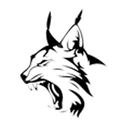

This software has been developed within the framework of the coordinated R + D + i project _New approach of research in physical activity and sport from mixed methods perspective_ (NARPAS_MM) \[SPGC201800X098742CV0\] (2019-2021), and it has been financed by the _Institut Nacional d’Educació Física de Catalunya_ (INEFC)

Alberto Soto1, Oleguer Camerino1, Marta Castañer1, Xavier Iglesias2 y M. Teresa Anguera3

1Institut Nacional d’Educació Física de Catalunya (INEFC) -Universitat de Lleida (UdL)

2 Institut Nacional d’Educació Física de Catalunya (INEFC) -Universitat de Barcelona (UB)

3 Universidad de Barcelona (UB)

    Soto, A., Camerino, O., Iglesias, X., Anguera, M. T., & Castañer, M. (2019). LINCE PLUS: Research Software for Behaviour Video Analysis. Apunts. Educación Física y Deportes, 137, 149-153. doi:10.5672/apunts.2014-0983.es.(2019/3).137.11

[](#trueinformation-about-lince-plus)Information about LINCE PLUS
-----------------------------------------------------------------

This information includes the initial steps to install and use Lince Plus without prior knowledge.

Lince is a free and open source project that emerges from the university environment to facilitate research and dissemination. We thank you for facilitating its dissemination and its citation since only then we can continue growing and evolving the product.

The first article you should consult is the following [https://www.revista-apunts.com/es/hemeroteca?article=1889](https://www.revista-apunts.com/es/hemeroteca?article=1889)

For users of the previous version of Lince, up to Lince 1.4, it is recommended to review it, although the transition of the project has been tried to make it as simple as possible.

LINCE PLUS is a program that evolves Lince including new features that increase the needs of the system, so it is designed to run on relatively powerful computers.

[](#truesystem-requirements)System requirements
-----------------------------------------------

System requirements:

* Java 1.8 or higher

* Mac OS, Linux or Windows


Desired system requirements:

* Windows 10 or Mac Os Mojave

* More than 4 GB RAM

* Java 1.8 or higher

* Intel i5 (7a gen) or higher


LINCE PLUS runs an internal server that demands more computing power than expected in previous versions. All the information is totally protected under the administration resources of the system.

[](#truelince-plus-installation)LINCE PLUS installation
-------------------------------------------------------

LINCE PLUS can be downloaded from the official website [https://observesport.github.io/lince-plus/](https://observesport.github.io/lince-plus/)

When accessing the web it is recommended to download the latest available version. Each version includes new features and corrects problems that different users are reporting. To see the different versions and the changes introduced, click on the "release notes" section of the website.

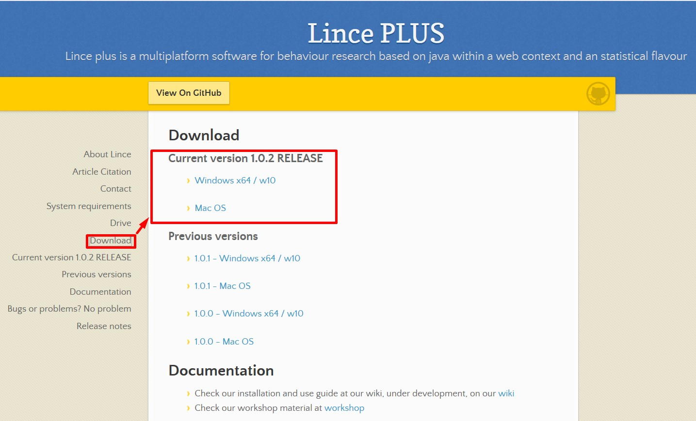

### [](#truewindows-installation)Windows installation

To install LINCE PLUS follow this instructions:

* Visit Lince repository website [http://observesport.github.io/lince-plus/](http://observesport.github.io/lince-plus/) to get the LINCE PLUS program in the "downloads" section by clicking on the link and execute it. *If you get a protection message in windows 10, accept it and authorize the installation. The software is not malicious.


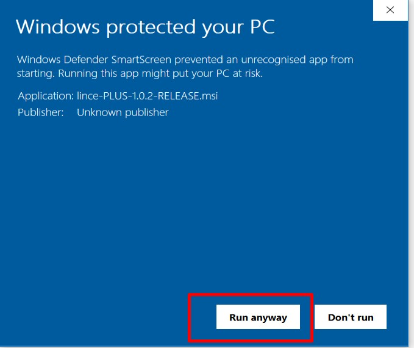

* Go by pressing "next", "accept conditions" and "install" to prepare the installation process (Figure 1). Then it will ask you if there is a previous version, and in this case you have to select "modify" (Figure 2).


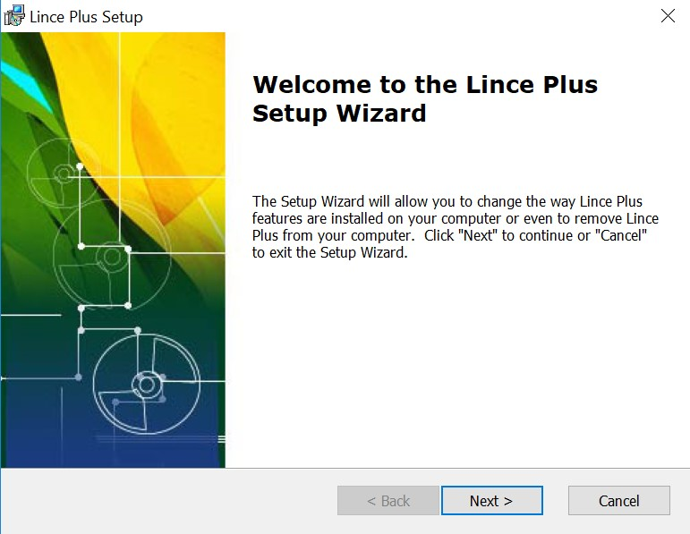

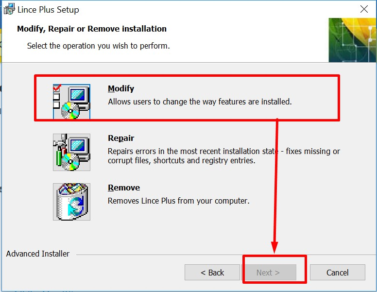

* In this version you must use at least java 1.8. Make the appropriate selection or it will automatically download the version in the system (Figures 3 and 4).


Once accepted, the installation process begins. Proceed to the next screen.

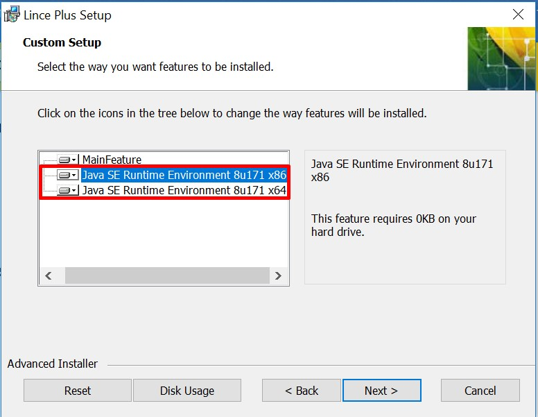

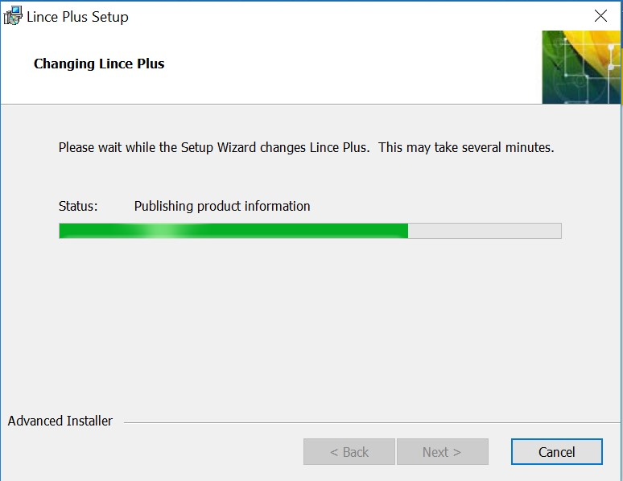

Once you have installed the java version, the installer will finish with the installation of LINCE PLUS. Its icon will be placed your desktop for execution.

### [](#truemac-os-installation)Mac OS installation

* The Mac installer is under development to facilitate the installation of java 1.8. By now, java 1.8 installation is manual.

* To install java version 1.8, you must register on the oracle website and download the JRE file for mac OS available on [https://www.oracle.com/technetwork/java/javase/downloads/jre8-downloads-2133155.html](https://www.oracle.com/technetwork/java/javase/downloads/jre8-downloads-2133155.html)


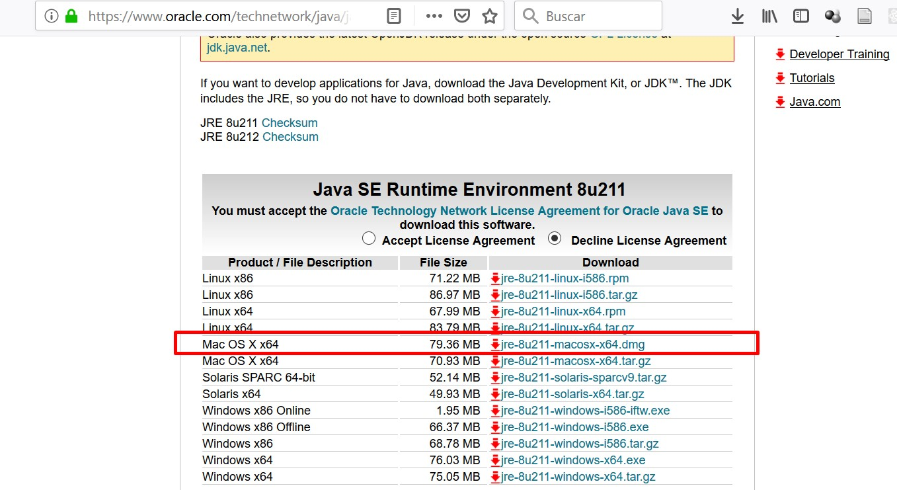

* The next step is to open the .zip file of Lince plus and execute directly.


[](#trueuse-of-lince-plus)Use of Lince Plus
-------------------------------------------

In this section the functions of LINCE PLUS are explained. It is recommended to read it carefully and testing the actions that are exposed in the program itself to understand its operation.

To execute LINCE PLUS we can click the desktop shortcut or search it among the programs using the Start button.

### [](#truemain-page)Main page

To execute it double click on the desktop icon and LINCE PLUS will start on the start screen (Figure 7).

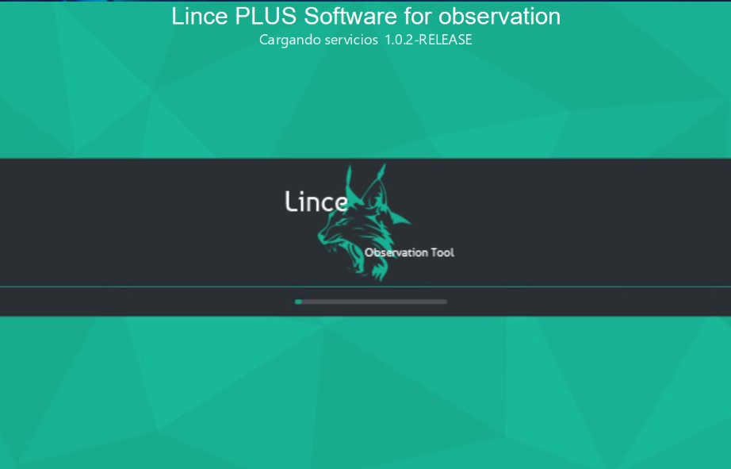

LINCE PLUS has been designed towards simplicity for easing user’s tasks, but, including the use of web technology requires that you keep in mind that it has two components: the desktop application and the web access that the application itself generates.

To start executing it, double click on the lynx icon or executable and you will see the loading screen.

### [](#truethe-environment-of-lince-plus)The environment of Lince Plus

The LINCE PLUS environment is divided into two distinct areas:

* The desktop or server application (Lince desktop). It is responsible for saving the information, managing the videos to observe and perform all kinds of imports or exports. It’s also used to manage the registration data.

* The web application (Lince web). It only works if LINCE PLUS desktop is running. It performs the interaction with the data and the analysis of the investigation.


### [](#truethe-desktop-application)The desktop application

From this application you can manage all the project information and have 4 work areas (Figure 8):

* Menu area: From here you can manage the research projects, selected videos and manage the interaction with other applications that you may use.

* Information area: In this area there is a summary of the project. If someone is connected you can see how scenes, observers or other data are changing.

* Article area: Cite us with the provided link and thank you in advance.

* Lower or footer area: You can see program messages and in Windows it will load the last used project, besides shows the PORT in which it is running. This aspect is of vital importance and is detailed in the section "first steps with LINCE PLUS".


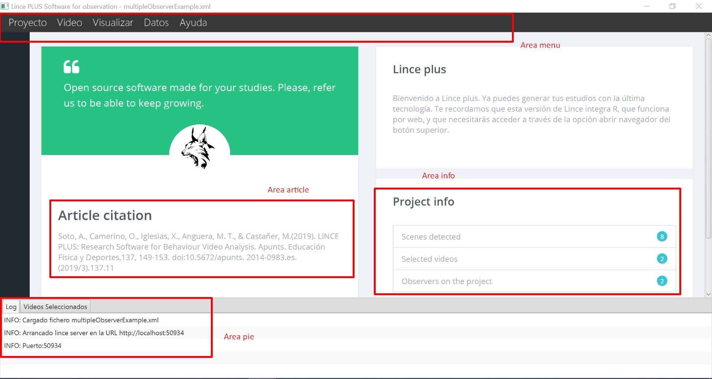

### [](#truethe-web-application)The web application

From LINCE PLUS desktop toolbarm select "View" → "Open browser" and it will open a browser screen.

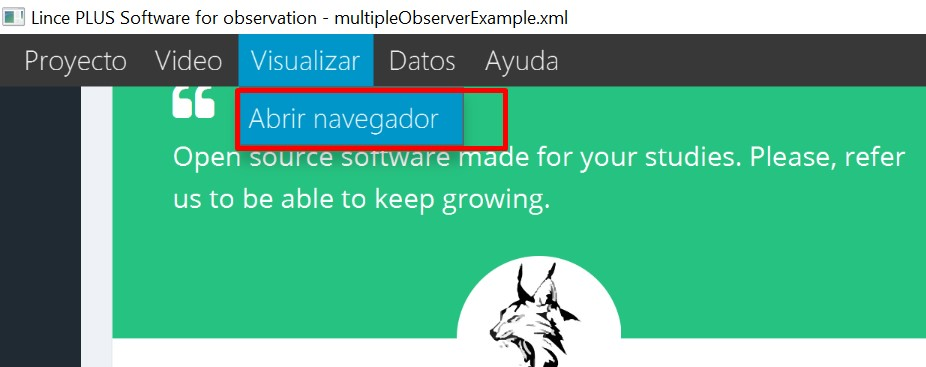

In the top bar of your browser you can detect the access address to the Lince web portal. The address will be a value similar to the following: [http://192.168.1.10:555](http://192.168.1.10:555). If you look at Figure 8, in the bottom area you can see a value called "port". This value, together with the IP of the computer generates the specific access address to the web application (Figure 10).

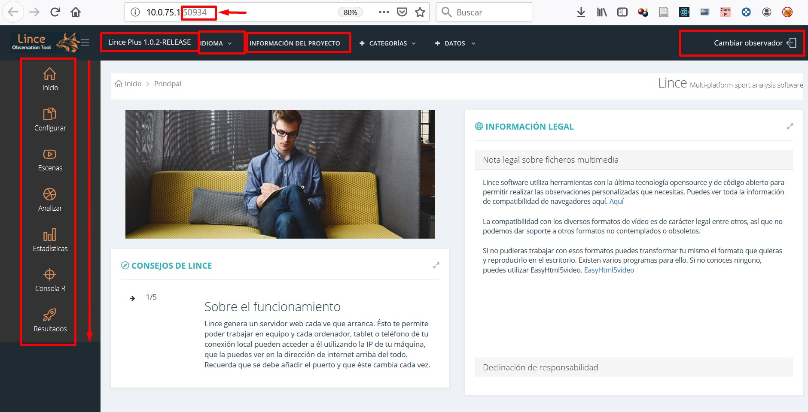

In this browser window you can see (Figure 10):

* Top menu. Here you can see the running version, language selector and modify the general information of the project. On the top right you can see an option for choosing observer. These aspects are detailed in the section "First steps with LINCE PLUS" and in the section "Group work".

* Sidebar Menu. Through the icons of this area you can follow the different observational methodology stages, starting with the observation instrument creation and then selecting moments or episodes to record and analyze, proceeding to the analysis phase. From there, you have a simple charting engine that summarizes what you have observed. More over, a specific section for result interpretation, being able to program your results directly with R directly or finding the reliability among different observers statistically.


As a general guideline, in each screen there is a series of icons that allow you to move the panel, maximize, minimize or distribute the work area. The upper right icon allows you to expand the panel to full screen, and when you select it again, minimize it to the original size. The side menu can be hidden.

[](#truefirst-steps-with-lince-plus)First steps with LINCE PLUS
---------------------------------------------------------------

When you start using LINCE PLUS, you must be clear about the objective of your research project to be able to generate a valid structure of the process. The first thing that must be considered are the following:

* How many observers participate in the project?

* Has the observation instrument been built?

* How many and which videos will I watch? Do they have the same duration?


### [](#trueobservation-instrument-configuration)Observation instrument configuration

The construction of the observation instrument is the first stage of the process. It can be proposed for both one-dimensional and multidimensional designs.

The typology of the observation instrument includes a system of categories (there will be a dimension or criterion), a field format (there will be several dimensions or criteria and catalogs of behaviors for each of them), or a field format combined with category systems (there will be several dimensions or criteria and systems of categories or catalogs of behaviors according to the characteristics of each dimension or criterion).

With the CONFIGURE option in the left side menu you can generate the structure of the observation instrument, first specifying the criteria / dimensions and then the categories / catalogs of behavior very easily, and sorting them intuitively using the icons shown in the image. Pressing the SAVE button displays a confirmation message.

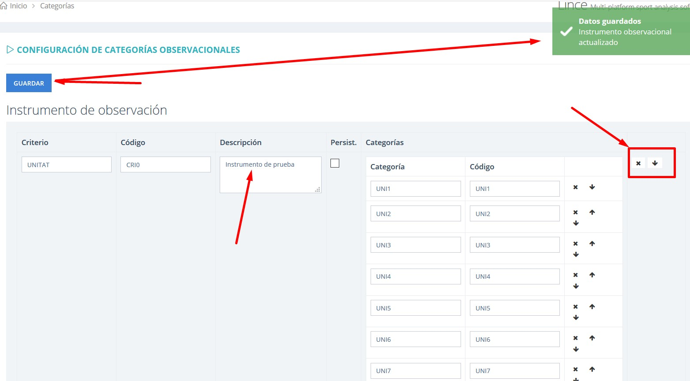

Figure 11: Observation instrument configuration

The observation instrument will be available to all users connected to the same project.

#### [](#trueautomatic-configuration-of-the-observation-instrument)Automatic configuration of the observation instrument

LINCE PLUS allows you to generate an instrument automatically, creating the keys and coding it quickly and easily. We recommend this option if you want to advance quickly or prepare tests that you want to edit later. To do so, an empty instrument must be generated, like the one in the attached image, and when saving, it enters all the fields automatically, calling them sequentially.

Simply select the options to add with the + symbol and generate all the criteria / dimensions and categories / behaviors that are desired without entering any text or only the values that interest. This option is very useful if the denomination is not yet definitive or if you want to start directly completely inductively. In the following image you can see the generated result.

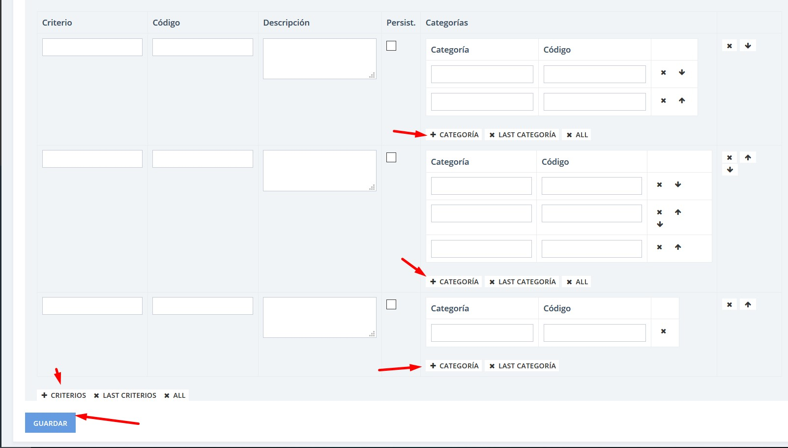

You can see how by selecting SAVE the information is automatically filled. Then, you can edit the desired values, but without forgetting SAVE before leaving this option.

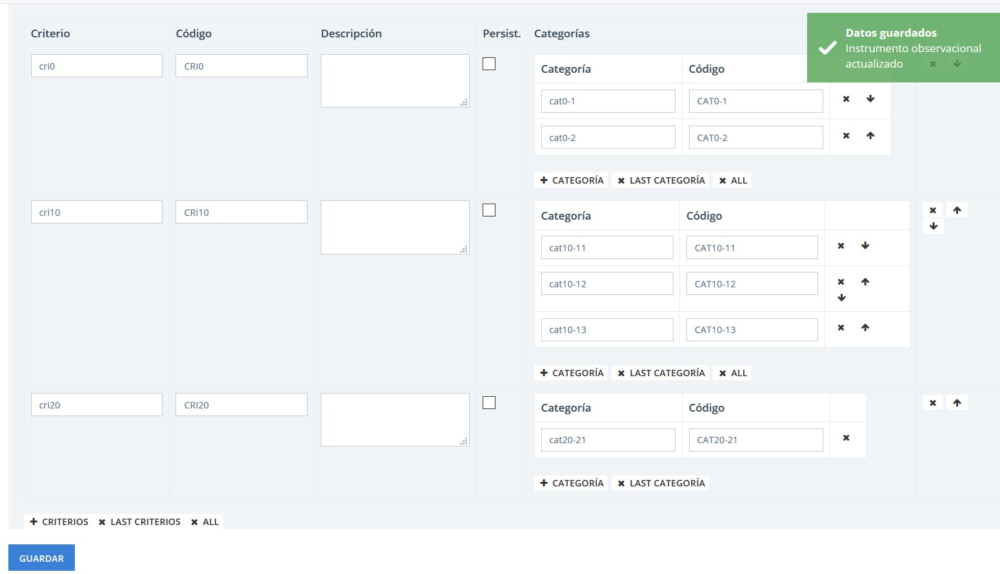

### [](#truevideo-selection)Video selection

LINCE PLUS allows you to play simultaneously several videos.

To access your selection you must use the Lince desktop application. In the top menu there is the tab "Video" → "Select videos". If you want to delete the entire selection, there is also the option for it. At the bottom of the screen there is a tab option called "Selected videos" which contains an updated selection. You can also see in "project info" how many videos are selected.

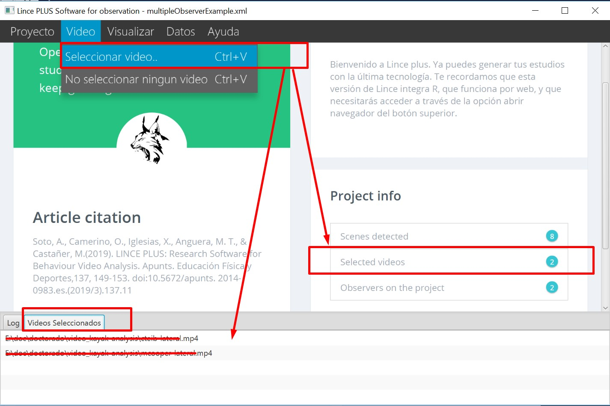

In the video selector the list of supported formats is displayed. As LINCE PLUS uses the web browser for playing videos, the video format must be reproducible by the user’s browser. In case other formats are used, you should convert it to a valid format.

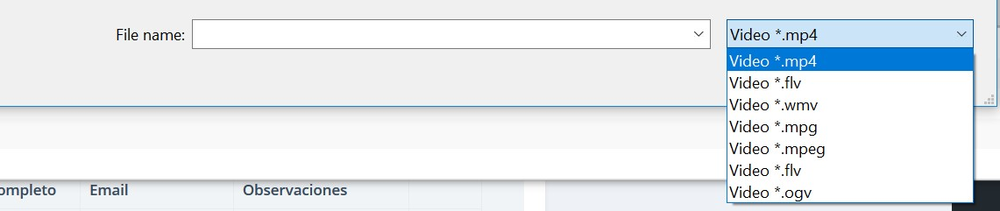

If several videos are shown simultaneously, make sure they have the same duration, otherwise LINCE PLUS will not be able to know which temporary mark of the video you want to use for register.

Another aspect to consider is the size of the video. All the selected videos are loaded into the computer memory simultaneously. If several 2GB videos are selected, the computer must be able to play them.

### [](#truenumber-of-observers)Number of observers

If there is only one observer in the project, it is not necessary to fill in this configuration, and the program will act transparently. However, if 2 or more observers participate, it must be specified from the beginning.

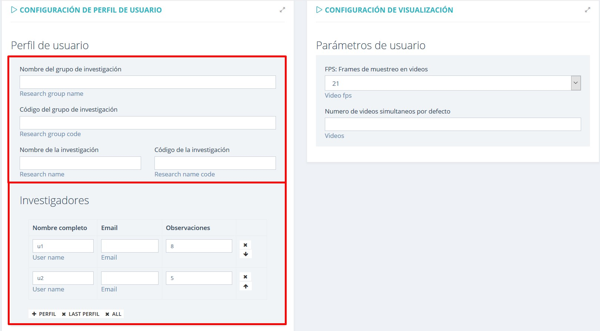

In the top button of the web environment there is an option called "Project information". It is important to define from the beginning how many observers are going to make the observation, and you must fill in the different fields and then select the button on the top right to "save everything".

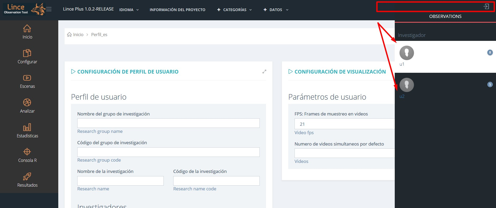

Now you have to navigate to another option to update the page and select the right button in the top bar and select "Change Observer".

To change the observer, select one and mark it as active. It will show you the contained records you have had analyzed and the temporary marks.

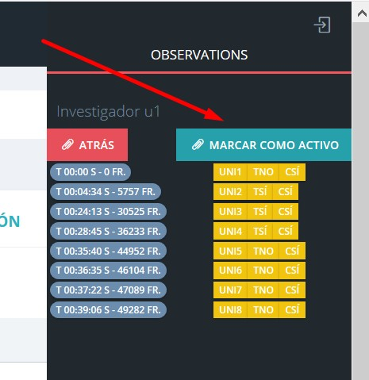

### [](#trueproject-information)Project information

Once we have configured videos and set up project information, we recommend you to save your project to avoid losing data. To do this, select the option Project → Save As

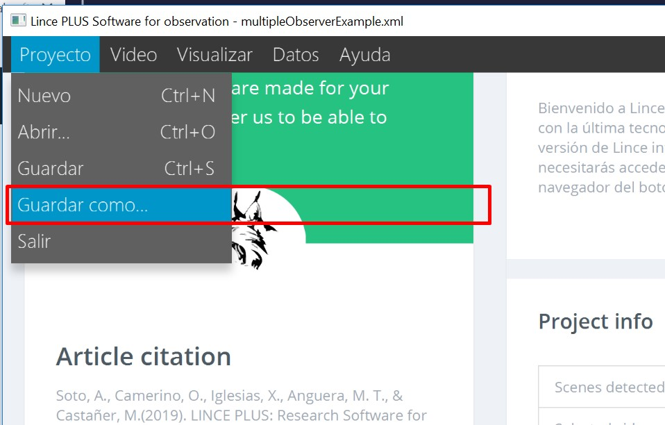

When closing Lince Desktop it will ask you to save the project, although it is recommended to keep saving the project continuously.

In Windows environment, when LINCE PLUS starts for the next time, it will load the last saved project automatically. This option is very useful to continue working on the same research.

If you have a project built under Lince 1.4 or earlier, it also supports including it to your research with the record file or with the instrument file. You can see this on detail in the section of "importing and exporting to external tools".

### [](#truedelimitation-of-observation-episodes)Delimitation of observation episodes

The episode delimitation is a new feature that allows you to set the observational sampling to materialize. The videos are previewed, where you can select what you want to observe and you can include additional comments.

This option is accessed from the "Scenes" section in the side menu. Before, you must have choosen selected videos to register.

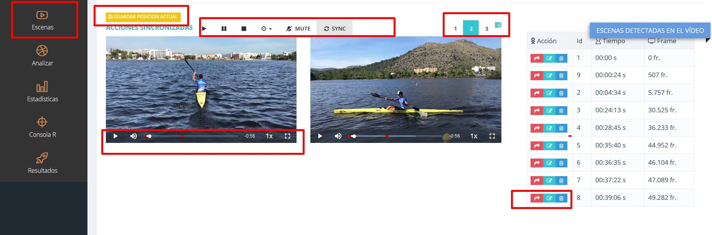

In this player there are several work areas:

* A synchronized video player that will play all the included videos simultaneously. The SYNC button allows you to synchronize the videos on the same playback moment as in the first video. You can also control the playback speed for all videos.

* An individual control for each video, which allows you to control all aspects, including playback speed.

* A selector of how many videos you want to watch together and change its disposition and default size.

* A menu of detected episodes. In each episode you can:

    * Play: A red button that plays instantly the video time that has been saved.

    * Edit: An edit button to add a comment.

    * Delete: Allows you to delete the entered scene and the observed records it contains


### [](#trueanalysis)Analysis

This option is the main work area for observation. It has been designed to simplify it to the maximum and to be similar to the previous version of Lince. All the episodes introduced previously with the observed records are found.

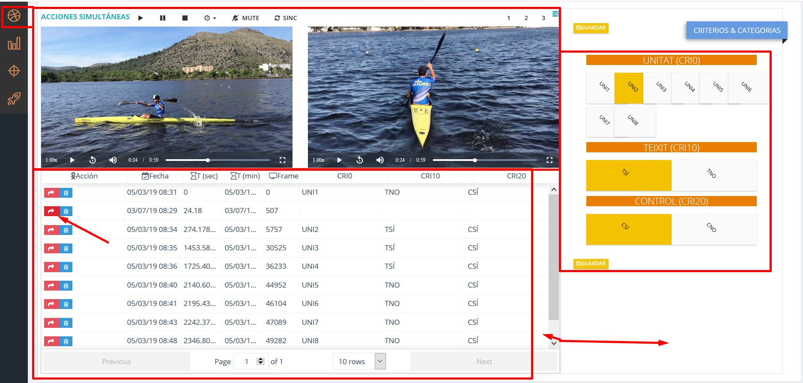

In this screen several sections are shown:

* Player zone: The player has the same conditions as the previous one and in the right lateral zone you will see the observation instrument.

* Registration area: All the selected episodes are shown with the observation values registered. You can order and edit all values. If you wish to modify an observation, press the red button and set the new observation in the instrument area. Save data for keeping changes without changing your timing.

* Instrument zone: Here you can mark what is being observed in the videos. When saving a new episode it generates and introduces the temporary mark of the first video, similar to the episodes.

* Adaptative zone: These are controls that allow you to adapt the work area for video and instrument, changing size and with a vertical line you can move.


### [](#trueregister-charts)Register charts

This option shows your register visually using simple charts. In the following example you can see how there is a moment in which no observation has been recorded yet in the episode 24,18.

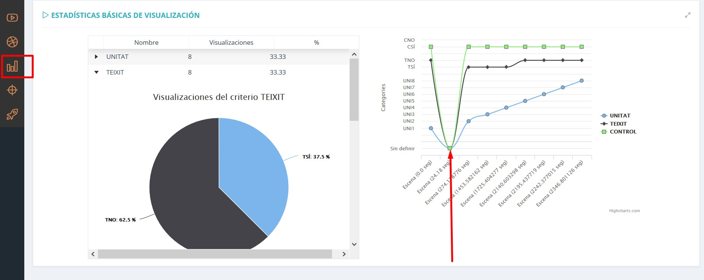

You can visually check the elements of the observation instrument in percentages and trendings in the different episodes of the record.

### [](#truedata-analysis)Data analysis

LINCE PLUS eases calcuting results automatically without using external tools, either by using the R programming language or by the automatic comparison of several observers for the calculation of the agreement index, including data quality control.

#### [](#truestatistical-results-using-r)Statistical results using R

This is one of the bigger new features of LINCE PLUS, because from now on an R language engine is included. If you navigate to the R-console option there is a component that allows you to calculate your desired results for your analysis.

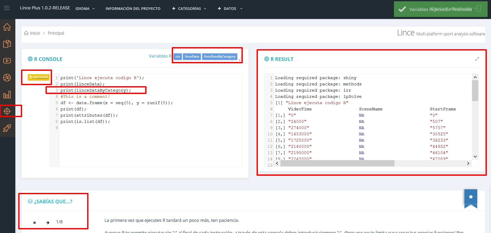

To be able to use it correctly you must have knowledge of the R programming language.

* In the left area there is an area to enter your source code and a button to execute it. In the upper area there are the variables that are loaded into R execution context from Lince which you can be use in your code. Pressing EXECUTE will show the results pane.

* In the right area you can see the text with the results of your calculation.

* In the lower area there is a HELP section to expand the information with some pieces of advice.


The graphics of R are not included, but can be accessed from R-Studio directly. You can consult the section of special features for it.

Unlike R, we need you to enter ";" at the end of each line. In R-Studio it is not mandatory.

    print(linceDataByCategory);

This code shows you on the screen the matrix of the record divided by categories. You can observe the time in ms and the exact frame based on 21fps.

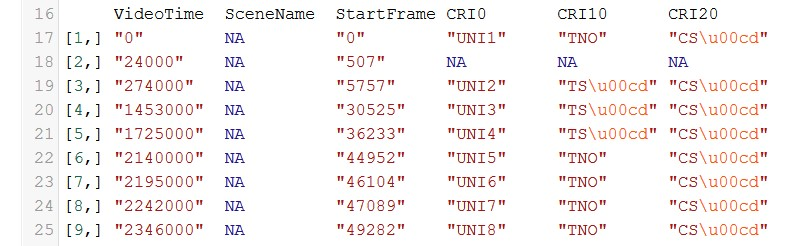

The intention of Lince Plus is that this option can be used by experts.

#### [](#truecalculation-of-the-agreement-between-several-observers)Calculation of the agreement between several observers

If several observers participate in the project, LINCE PLUS allows you to calculate the agreement between the different observers and to know if they are concordant in the registration of the same aspects in the observation, being able to calculate the agreement rates through Kappa or Krippendorf and generate the contingency matrix between your observations.

For its calculation, the observers must have the same episodes, number of episodes and an independent record of each of them.

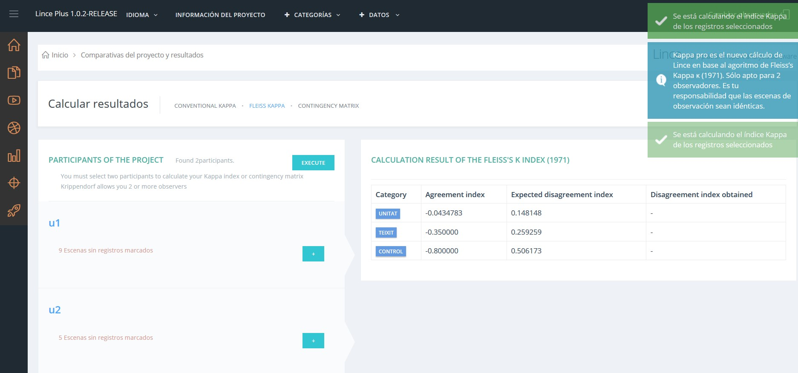

How to perform the calculation:

1.  In the left side menu, select the "+" button to preview the observer’s record. You can select several times and see how the color changes from green to white. When it is green, the observer is selected.

2.  Select another observer and access the desired result in the top menu

3.  In "Calculate results", select the desired option (Kappa, Krippendorf coefficient, …​)

4.  Press EXECUTE to visualize the result.


Future versions of LINCE PLUS will force you to register identical episodes.

[](#trueimport-and-export-of-data)Import and export of data
-----------------------------------------------------------

LINCE PLUS allows the integration of external registries and other applications.

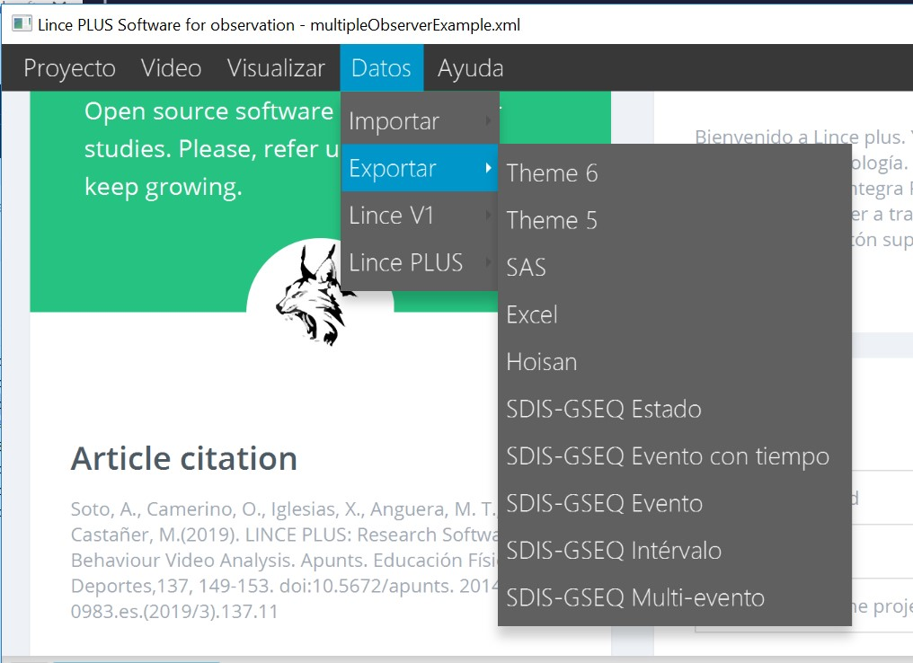

* Import

    * Hoisan

    * Instrument and record of Lince 1

    * Import an external LINCE PLUS project. It allows you to open projects from other computers without modifying your selected videos.

    * Import an external observational record. This option generates a new observer.


* Export

    * Theme 5 and 6

    * Excel, using CSV with ";" separator or "," for all systems

    * SAS

    * GSEQ

    * Lince 1, both instrument and record.


[](#trueconnecting-other-devices)Connecting other devices
---------------------------------------------------------

You can use Lince desktop on your computer and watch your videos comfortably from another device or tablet. In smartphone too, but the amount of information that will manage will not be comfortable to use.

Remote access is very simple, since you only have to access the _direction_ of your machine with the _port_ you have:

* The address of your machine is your ip value. To discover it, access the section "Discover your ip"

* The port is informed every time LINCE PLUS starts and always changes due to security aspects.


The address that you have to open in your browser is similar to the following:

[http://10.0.75.1:53715](http://10.0.75.1:53715)

```markdown
- http://{IP}:{PUERTO}
- Example: http://10.0.75.1:53715
- If you have questions about how to connect see the section "discover your IP"
```

The port is reported in the application, in the lower frame just on startup.

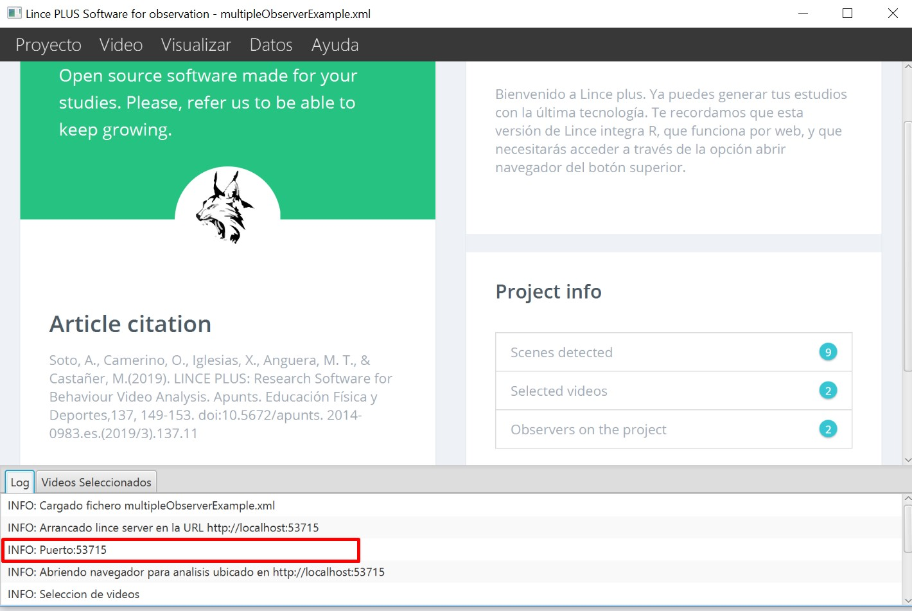

[](#trueteam-work)Team work
---------------------------

LINCE PLUS allows a wide range of possibilities under a simple work system and, especially, allowing several researchers to collaborate simultaneously.

Here are some of these aspects: - Each observer generated in the "Project information" section generates a new observer profile. - Each observer has an observation record, independent from the rest.

This allows you to perform simultaneous observations within several observers, generating several scenarios :

* Several researchers working at the same time with each observer in different time zones of the video to accelerate the work. This facilitates the observation of the video splitting the work to be done.

* If we generate several observers, each one of them can try to observe the same episodes and the same details, for analyze later if each observer visualizes the same details calculating their agreement index.

* Generate several observers, who can register diferent details of the video. An example would be analyzing a competition in which 2 teams participate, so that each observer registers one of the teams.


All this can be done simultaneously thanks to collaborative work.

> If there are doubts about how to connect, consult the section "Discover your IP"

[](#trueconnection-of-r-studio-to-lince-plus)Connection of R Studio to Lince plus
---------------------------------------------------------------------------------

If you want more statistical power, or generating reports with more complex graphics, you can connect R Studio to Lince. For this you can follow the advice you have in the section "Console R" in the web interface.

In summary, the process is as follows:

* First, install the development tools in R-studio using the following command in an script window. This process may take a few minutes.

install.packages("devtools")

Then prove that it works correctly with the following example:

```bash
library(jsonlite)
hadley_orgs <- fromJSON("https://api.github.com/users/hadley/orgs")
print(hadley_orgs)
```


This allows you to connect to an external web page and consult data, generating the variable 'hadley_orgs', with the data of the api rest.

* Next, we will connect to LINCE PLUS, for this you can access section 5 of the R console or connect directly to the following code by changing the port with which the LINCE PLUS application informs you as shown in the image.

```bash
library(jsonlite)
lince_data <- fromJSON("http://localhost:53715/register/get")
print(lince_data)
```

Observe in the image how the number "53715" matches the one reported by the Lince desktop application


[](#trueproblems-during-program-installation)Problems during program installation
---------------------------------------------------------------------------------

If any incompatibility or problem occurs at the start of Lince Plus, it is probably due to the incompatibility of the java version.

In this case, it is recommended to check the java version and perform the installation manually. To proceed with this, we will do the following:

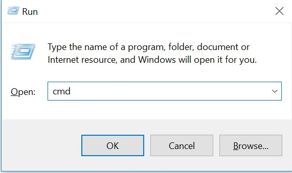

* Windows: In the windows icon, we will search 'execute'. You can also press "key **windows + r** ". Enter " **cmd** " and open a terminal.

* MacOs: With the key **cmd + space** a wizard opens. Enter " **terminal** " and click on the result.


In both systems, a dark text screen opens. On this screen enter "java -version".

You will know if you have it installed properly or not.

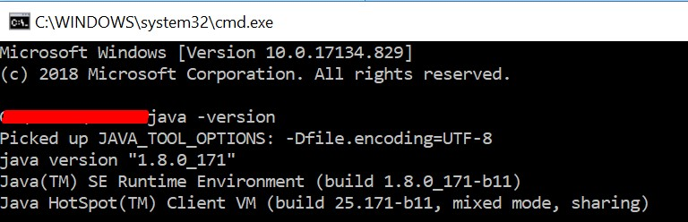

If the result is not recognized, it is because you do not have it installed. Proceed to download from the following page: [https://www.oracle.com/technetwork/java/javase/downloads/jre8-downloads-2133155.html](https://www.oracle.com/technetwork/java/javase/downloads/jre8-downloads-2133155.html)

### Discover your IP

The ip is an identifier of your computer and it changes in each network which you are connected. If you work in the office and at home, you will have different IPs.

To know what ip you have, open a terminal (It is detailed in the previous section), and enter the following value:

* In the case of windows " **ipconfig** "

* In case of macos or linux " **ifconfig** "


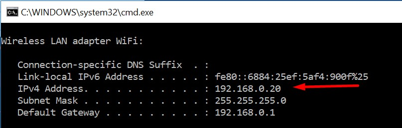

Your accessible ip can be shared with other devices or with other users to start collaborative work. In the case of the image, it would be accessed through the following address

```bash
https://192.168.0.20:53715
```


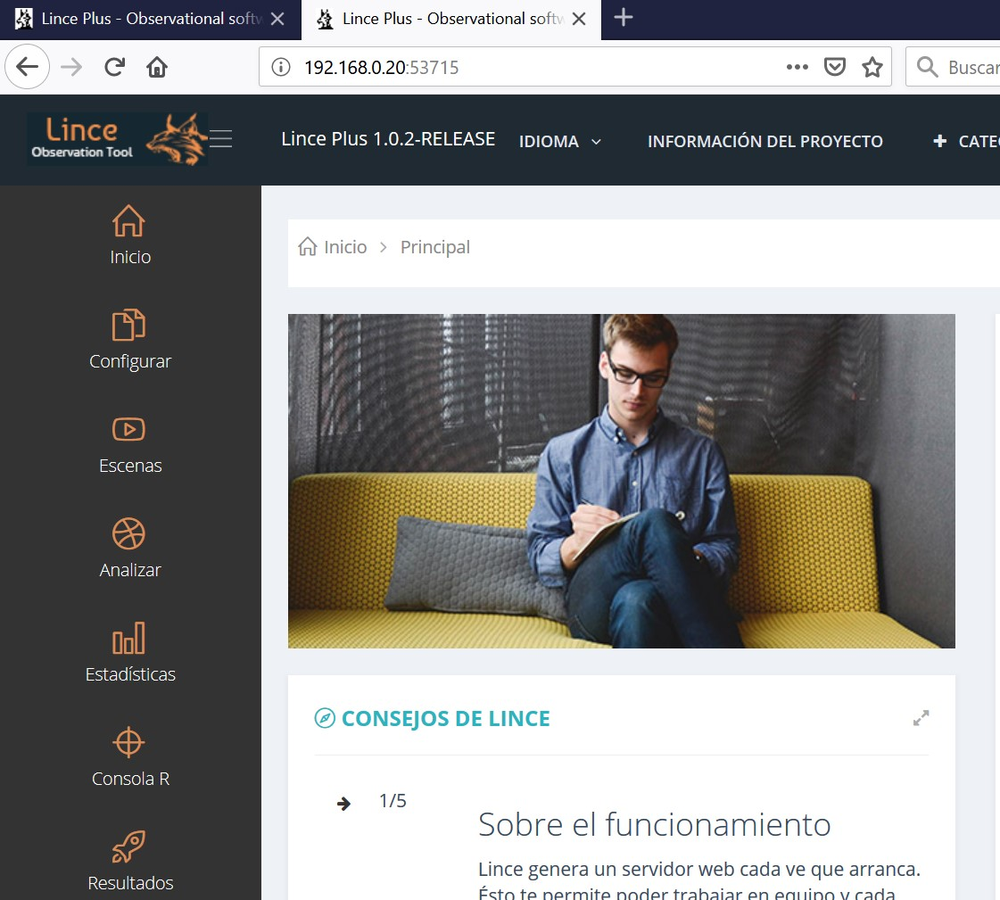
